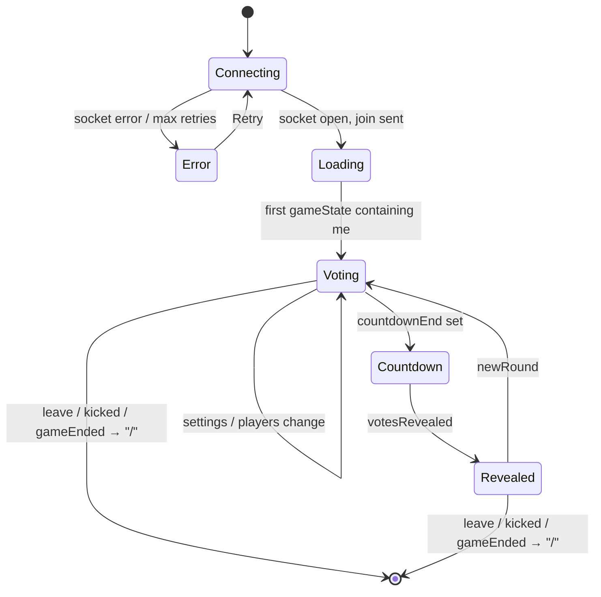
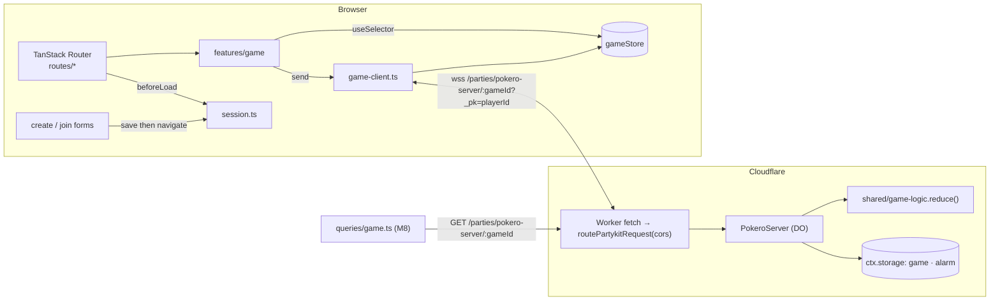

# Pokero — Greenfield Implementation Plan

> Status: Proposal · Companion to [MIGRATION_PLAN.md](MIGRATION_PLAN.md)
> Goal: rebuild **every user-visible behaviour** of Pokero from an empty directory on the target
> stack (TanStack Router + TanStack Store, PartyServer on Cloudflare Workers, Zod shared schemas,
> Vitest), fixing the defects catalogued below instead of porting them.

The migration plan describes how to get the _existing_ repo to the target architecture
incrementally. This document is the alternative path: the same destination, built clean. Both
share §2–§4 (specification) so either path can be verified against the same parity checklist (§9).

---

## 1. Scope & principles

**In scope (functional parity):** landing page, create/join flows, real-time game room (vote,
reveal with countdown, stats, round history, settings, invite, leave/end, kick, transfer admin,
spectator mode, reconnection), light/dark theme, session persistence, deployment to Vercel +
Cloudflare Workers.

**Deliberately changed (see §3.4 for the full list):** server-authoritative admin, creator
settings sent with `join`, deck-validated votes, durable room state, single icon set, no
client-side "encryption", no `location.state`.

**Out of scope:** accounts, persistence beyond a room's lifetime, analytics, i18n, SSR.

Principles:

1. **Domain logic is pure and shared.** All game-state transitions and statistics live in
   `shared/` with zero runtime dependencies (other than Zod). Server and client import the same code;
   tests run in plain Node.
2. **One source of truth per concern.** Wire types → Zod schemas. Game state → the Durable Object.
   Client game view → `gameStore`. Player identity → `sessionManager`.
3. **Routes are declarative and guarded.** No effect-based redirects; `beforeLoad` does the work.
4. **Every milestone ships a runnable vertical slice** with tests, so the plan can stop at any
   milestone and still have a working (if partial) app.

---

## 2. Functional specification (what must exist)

### 2.1 Routes & screens

| Route           | Screen         | Elements                                                                                                                                                                                                                                                                                                                                                                                                                                                                                                                                                                                                                                                                                                                                                                                                      |
| --------------- | -------------- | ------------------------------------------------------------------------------------------------------------------------------------------------------------------------------------------------------------------------------------------------------------------------------------------------------------------------------------------------------------------------------------------------------------------------------------------------------------------------------------------------------------------------------------------------------------------------------------------------------------------------------------------------------------------------------------------------------------------------------------------------------------------------------------------------------------- |
| `/`             | Landing        | Fixed **Navbar** (logo + "Pokero", ThemeToggle, ghost "Join Game", primary "Create Game" with expand-icon effect). **Hero** ("Planning Poker," / "Simplified" in primary; sub-copy "Free, instant estimation. No sign-up. Just share a link and play."; CTAs "Start a Session" → `/create`, outline "Join Game" → `/join`; footnote "No account needed. Seriously."), animated background. **Why Pokero** (4 tiles: No Accounts / No Stored Data / 100% Free / Instant Setup). **How it works** (3 cards: Create a Room / Invite Your Team / Play your Cards). **CTA** ("Your Next Estimation Session is One Click Away" / "No sign-up. No credit card. No nonsense." / "Start a Session"). **Footer** (logo → `/`, © year Brendan Sadlier, links GitHub · Request Features · Report Bugs · Buy Me a Coffee). |
| `/create`       | Create Game    | Back-to-home link. Card "Create a Game": **Name** (required, ≤50), **Game Name** (optional, ≤100, placeholder "Leave blank for 'Planning Poker'"), **Voting Type** select (Fibonacci ▸ default, T-Shirt Sizing, Powers of 2), accordion **Game Settings** → switches "Allow All Players to Reveal Cards" (default on), "Spectator Mode" (default off). Submit "Create Game" (busy: spinner + "Creating..."). Footer link "Already have a game? Join a Game". Animated background.                                                                                                                                                                                                                                                                                                                             |
| `/join?gameId=` | Join Game      | Back-to-home link. Card "Join a Game": **Name** (required, ≤50), **Game ID** (required, pre-filled from `?gameId`, lower-cased as you type, helper "Game IDs are case-insensitive"). Submit "Join Game" (busy: "Joining..."). Footer link "Don't have a Game ID? Create a Game". Animated background.                                                                                                                                                                                                                                                                                                                                                                                                                                                                                                         |
| `/game/$gameId` | Game Room      | See §2.2.                                                                                                                                                                                                                                                                                                                                                                                                                                                                                                                                                                                                                                                                                                                                                                                                     |
| `*`             | Not Found      | **New.** Friendly 404 with "Back to Home".                                                                                                                                                                                                                                                                                                                                                                                                                                                                                                                                                                                                                                                                                                                                                                    |
| (any)           | Error boundary | "Something went wrong" · message · "Try Again" / "Reload Page" · dev-only component stack.                                                                                                                                                                                                                                                                                                                                                                                                                                                                                                                                                                                                                                                                                                                    |

### 2.2 Game room states



| State      | UI                                                                                                                                                                                                                                                                                                                                                                                                                                                                                                                                                                                                                                                                                                                                                                                                       |
| ---------- | -------------------------------------------------------------------------------------------------------------------------------------------------------------------------------------------------------------------------------------------------------------------------------------------------------------------------------------------------------------------------------------------------------------------------------------------------------------------------------------------------------------------------------------------------------------------------------------------------------------------------------------------------------------------------------------------------------------------------------------------------------------------------------------------------------- |
| Connecting | Centered spinner + "Connecting to game" + " (attempt N)" when `retryCount > 0`.                                                                                                                                                                                                                                                                                                                                                                                                                                                                                                                                                                                                                                                                                                                          |
| Error      | Alert icon · "Connection Error" · `error.userMessage` · outline "Retry" (reconnect) · "Back to Home".                                                                                                                                                                                                                                                                                                                                                                                                                                                                                                                                                                                                                                                                                                    |
| Loading    | Spinner + "Loading game...".                                                                                                                                                                                                                                                                                                                                                                                                                                                                                                                                                                                                                                                                                                                                                                             |
| Voting     | **GameHeader**: logo + game name · my name · "Invite Players" dialog · ThemeToggle · **History** sheet (badge = rounds) · **Settings** dialog (admin only) · **Leave** (destructive icon). **VoteStatusCards**: one card per player — dashed outline (not voted), filled + ✓ (voted), 👁 (spectator), value (revealed); crown next to admin's name; admin sees hover actions "Make Admin" / "Kick Player" on other players (each with confirm dialog). Below: `Reveal Votes` button when _all non-spectators voted_ ∧ _I can reveal_ ∧ _voters > 1_; **VotingCards** ("Choose Your Card ▾", deck for current voting type, selected card lifted/scaled) or **SpectatorView** ("👁️ Spectating" / "You are observing this round"); "Waiting for admin to reveal votes..." when all voted ∧ I cannot reveal. |
| Countdown  | Full-screen blurred overlay, 3 → 2 → 1 animated, "Revealing votes...". Voting locked.                                                                                                                                                                                                                                                                                                                                                                                                                                                                                                                                                                                                                                                                                                                    |
| Revealed   | Cards show values. Admin sees "Start New Round". **RoundStats** fixed bottom bar: Average (numeric mean, 1 dp, or —), Winning Vote (mode; up to 3 values on tie; —), Agreeability (%, 1 dp; —).                                                                                                                                                                                                                                                                                                                                                                                                                                                                                                                                                                                                          |

### 2.3 Dialog & sheet contents

- **Invite Players:** read-only mono input with `${origin}/join?gameId=${id}` + "Copy Invite Link" (closes; toast).
- **Game Settings (admin):** Name, Voting Type (helper "Changing voting type will reset all current votes"), switches as on Create; "Cancel" resets; "Save Changes" sends only the diff.
- **Round History (sheet, right):** title "Round History"; description "No rounds completed yet. Results will appear here after each reveal." or "N round(s) completed"; newest first; each card: "Round N" + HH:MM · Avg / Winner (+ "(tie)") / Agree % (0 dp) · "N voter(s) · <Voting type>" · chips `name value` sorted by name.
- **Leaving so Soon? (alert):** non-admin: "Are you sure you want to leave this game? You can rejoin later using the same link." → Cancel / Leave Game. Admin: "You are the admin of this game. If you leave, admin privileges will be transferred to another player. Are you sure you want to leave?" → Cancel / split button **Leave Game** ▾ **End Game**.
- **Kick {name}?** "This will remove {name} from the game. They can rejoin using the same invite link." → Cancel / Kick Player.
- **Transfer Admin to {name}?** "This will make {name} the new admin of this game. You will become a regular player and lose access to admin controls like settings, ending the game, and starting new rounds." → Cancel / Transfer Admin.

### 2.4 Toast copy (exhaustive)

| Trigger                  | Kind               | Text                                                                                                                                                                                                                                                                |
| ------------------------ | ------------------ | ------------------------------------------------------------------------------------------------------------------------------------------------------------------------------------------------------------------------------------------------------------------- |
| gameEnded (others)       | info               | "{by} has ended the game." · "You will be redirected to the home page." → `/` after 1.5 s                                                                                                                                                                           |
| playerLeft               | info               | "{name} has left the game."                                                                                                                                                                                                                                         |
| playerKicked (me)        | error              | "You were kicked from the game by {by}." · "You will be redirected to the home page." → `/` 1.5 s                                                                                                                                                                   |
| playerKicked (other)     | info               | "{name} was kicked from the game."                                                                                                                                                                                                                                  |
| adminTransferred (to me) | success            | "{from} made you the admin!"                                                                                                                                                                                                                                        |
| adminTransferred (other) | info               | "{from} transferred admin to {to}."                                                                                                                                                                                                                                 |
| reconnected              | success            | "Reconnected to the game!"                                                                                                                                                                                                                                          |
| leave / end (self)       | success            | "You have left the game." / "You have ended the game."                                                                                                                                                                                                              |
| guard failures           | warning            | "Spectators cannot vote" · "Voting is locked during countdown" · "Only the admin can reveal votes" · "Only the admin can start a new round" · "Only the admin can update settings" · "Only the admin can kick players" · "Only the admin can transfer admin rights" |
| settings dialog          | error/success/info | "Game name cannot be empty" · "Game name must be 100 characters or less" · "Settings updated successfully" · "No changes to save"                                                                                                                                   |
| invite dialog            | success/error      | "Game link copied to clipboard!" · "Failed to copy link"                                                                                                                                                                                                            |
| form validation          | error              | "Please enter your name" · "Name cannot exceed 50 characters" · "Game name cannot exceed 100 characters" · "Please enter a valid Game ID" · "Invalid Game ID format"                                                                                                |
| navigation failure       | error              | "Failed to create game. Please try again." · "Failed to join the game. Please try again."                                                                                                                                                                           |

### 2.5 Domain rules (server-authoritative)

Constants: `MAX_NAME_LENGTH 50`, `MAX_GAME_NAME_LENGTH 100`, `GAME_ID /^[a-z0-9]{5,15}$/` (generated length 7), `COUNTDOWN_MS 3000`, `SESSION_TTL 24h`, reconnection `{ maxRetries 5, initial 1000 ms, max 30000 ms, factor 2 }`.

Decks: Fibonacci `0 1 2 3 5 8 13 21 34 ?` · T-Shirt `XS S M L XL XXL ?` · Powers of 2 `0 1 2 4 8 16 32 64 ?`.

Defaults: `{ gameName: 'Planning Poker', allowPlayersToReveal: true, adminCanSpectate: false, votingType: 'fibonacci' }` — **one** set, shared (today server and client disagree).

| Message          | Precondition                                                                          | Effect                                                                                                                                                                                                   | Broadcast                       |
| ---------------- | ------------------------------------------------------------------------------------- | -------------------------------------------------------------------------------------------------------------------------------------------------------------------------------------------------------- | ------------------------------- |
| connect          | —                                                                                     | Send current `gameState` to the new connection if the room exists.                                                                                                                                       | —                               |
| `join`           | name non-empty after trim/≤50                                                         | If room empty: create with joiner as admin and **`settings` from the message** (defaults otherwise). Upsert player `{ isAdmin: id === adminId, isSpectator: isAdmin && adminCanSpectate, vote: null }`.  | `gameState`                     |
| `vote`           | player exists ∧ ¬spectator ∧ ¬revealed ∧ ¬counting down ∧ **vote ∈ deck(votingType)** | Set `vote`, `hasVoted = true`.                                                                                                                                                                           | `gameState`                     |
| `reveal`         | player exists ∧ (admin ∨ allowPlayersToReveal) ∧ ¬counting down ∧ ¬revealed           | `countdownEnd = now + 3000`; schedule reveal.                                                                                                                                                            | `gameState`                     |
| (reveal fires)   | countdownEnd reached                                                                  | `votesRevealed = true`, `countdownEnd = null`, append history entry (skipped if 0 voters).                                                                                                               | `gameState`                     |
| `newRound`       | admin                                                                                 | Cancel countdown; clear all votes; `votesRevealed = false`, `countdownEnd = null`, `roundActive = true`.                                                                                                 | `gameState`                     |
| `updateSettings` | admin                                                                                 | Patch fields (name sanitised, non-empty). `adminCanSpectate` → admin's `isSpectator` (clear vote if now spectating). `votingType` change → clear all votes, `votesRevealed=false`, **cancel countdown**. | `gameState`                     |
| `leave` / close  | player exists                                                                         | Remove player. If admin: promote first remaining player (**apply `adminCanSpectate` to them**, same as transfer).                                                                                        | `playerLeft`, `gameState`       |
| `kickPlayer`     | admin ∧ target ≠ self ∧ target exists                                                 | Remove target.                                                                                                                                                                                           | `playerKicked`, `gameState`     |
| `transferAdmin`  | admin ∧ target ≠ self ∧ target exists                                                 | Old admin `isAdmin=false, isSpectator=false`; new admin `isAdmin=true, isSpectator=adminCanSpectate` (clear vote if spectating); `adminId`.                                                              | `adminTransferred`, `gameState` |
| `endGame`        | admin                                                                                 | Cancel countdown; room state deleted.                                                                                                                                                                    | `gameEnded`                     |
| malformed        | —                                                                                     | —                                                                                                                                                                                                        | `error` to sender only          |

Statistics (shared `stats.ts`, used for both live stats and history):

- `distribution[vote]++` over non-spectators with a vote; `average` = mean of `parseFloat`-able votes (null if none); `winners` = votes with max count, `isDraw = winners.length > 1`.
- `agreeability`: `idx(v)` = index in deck; `mean = Σ idx·count / n`; `avgDist = Σ |idx−mean|·count / n`; `maxDist = max(deck.length−1, 1)`; result `clamp(1 − avgDist/maxDist, 0, 1) × 100`; `null` when `n = 0`.

### 2.6 Client identity & sessions

- `playerId = player_${Date.now()}-${random7}`; it is the WebSocket connection id (`_pk`), so reconnecting with the same id re-associates the player.
- Session record per game in `localStorage` key `pokero_session_<gameId>`: `{ playerId, playerName, gameId, isAdmin, timestamp, settings? }`, plain JSON, validated on read, 24 h TTL, `sessionStorage` fallback. Expired sessions swept at startup.
- Written by Create/Join **before** navigating; read by the game route guard; cleared on leave/kick/end.
- **Refresh = reconnect** (recommended default; see §8 #1): no `beforeunload` clearing.

### 2.7 Visual design

- Tokens exactly as today's [src/index.css](src/index.css): oklch palette, primary green `oklch(0.6036 0.1618 141.68)` light / `oklch(0.7111 0.1929 141.62)` dark, `--radius: 1rem`, neutral greys, chart-1…5, shadow scale. Class-based dark mode (`.dark` on `<html>`), default theme **dark**, persisted under `vite-ui-theme`.
- Fonts: **Outfit** (body) and **Bricolage Grotesque** (display/headings), self-hosted via `@fontsource-variable/*` instead of Google Fonts `@import` (removes a render-blocking request; optional but recommended).
- Motion: animated background circles (slow scale/rotate + two floating dots), hero/nav fade-ins, countdown scale/fade, `slideUp` for the stats bar, button `expandIcon` hover effect.
- Icons: **one** set — Tabler (`@tabler/icons-react`). Lucide equivalents map 1:1 (`AlertCircle→IconAlertCircle`, `RefreshCw→IconRefresh`, `CircleCheck→IconCircleCheck`, `Eye→IconEye`, `Scale→IconScale`, `Trophy→IconTrophy`, `Handshake→IconHeartHandshake`, `AlertTriangle→IconAlertTriangle`, `ArrowLeft→IconArrowLeft`, `Loader2→IconLoader2`).
- shadcn primitives required: accordion, alert-dialog, button (+ `effect`/`icon` variants), button-group, card, dialog, dropdown-menu, field, input, label, select, sheet, sonner, switch, tooltip. (checkbox / collapsible / separator exist today but are unused — omit.)

---

## 3. Target architecture

### 3.1 Stack

| Layer          | Choice                                                                                                                                                                                    | Version (2026-09)       |
| -------------- | ----------------------------------------------------------------------------------------------------------------------------------------------------------------------------------------- | ----------------------- |
| Build          | Vite 7, TypeScript 5.9, `@vitejs/plugin-react`, `@tailwindcss/vite`                                                                                                                       | current                 |
| UI             | React 19, Tailwind v4, shadcn (Radix via `radix-ui` meta-package), `motion`, `sonner`, `@tabler/icons-react`, `react-wrap-balancer`, `class-variance-authority`, `tailwind-merge`, `clsx` | current                 |
| Routing        | `@tanstack/react-router` + `@tanstack/router-plugin` (file-based, auto code-split) + devtools                                                                                             | ^1.170                  |
| Client state   | `@tanstack/react-store` (`createStore`, derived stores, `useSelector`)                                                                                                                    | ^0.11                   |
| Server data    | `@tanstack/react-query` — **only** for the room-metadata endpoint (M8)                                                                                                                    | ^5.103                  |
| Validation     | `zod` (v4) — shared wire schemas, router `validateSearch`, env parsing                                                                                                                    | ^4.6                    |
| Realtime       | `partysocket` (client) · `partyserver` (Durable Object) · `wrangler`                                                                                                                      | ^1.3 · ^0.5.10 · ^4.136 |
| IDs            | `nanoid` `customAlphabet('0-9a-z', 7)`                                                                                                                                                    | ^5                      |
| Tests          | `vitest` (jsdom project for `src/`, node project for `shared/`, `@cloudflare/vitest-pool-workers` for `party/`), `@testing-library/react`, `@testing-library/user-event`                  | ^5 / ^0.22              |
| E2E (optional) | Playwright — two-context vote/reveal smoke test                                                                                                                                           | current                 |
| Quality        | ESLint 9 flat config (`typescript-eslint`, `react-hooks`, `react-refresh`, `@tanstack/eslint-plugin-router`, `@tanstack/eslint-plugin-query`), Prettier 3, Husky + lint-staged            | current                 |
| Hosting        | Vercel (SPA, `/(.*) → /` rewrite) + Cloudflare Worker (`pokero-party`) — or single Worker with static assets (§8 #5)                                                                      | —                       |

### 3.2 Repository layout

```
pokero/
├─ shared/                     # pure domain, imported by both party/ and src/
│  ├─ constants.ts             # decks, limits, defaults, reconnection config
│  ├─ schema.ts                # zod: GameSettings, Player, GameState, RoundHistoryEntry,
│  │                           #      ClientMessage, ServerMessage, GameId, PlayerName, PlayerSession
│  ├─ game-logic.ts            # reduce(state, command, ctx) → { state, events, alarmAt }
│  ├─ stats.ts                 # calculateRoundStats, agreeability, winners
│  └─ *.test.ts
├─ party/
│  ├─ index.ts                 # PokeroServer extends Server<Env> + default fetch
│  ├─ codec.ts                 # encode/decode ServerMessage
│  └─ server.test.ts           # vitest-pool-workers
├─ src/
│  ├─ main.tsx                 # sweep sessions → RouterProvider
│  ├─ router.tsx               # createRouter + Register
│  ├─ routeTree.gen.ts         # generated, committed
│  ├─ routes/
│  │  ├─ __root.tsx            # providers, Outlet, NotFound, RouteError, devtools
│  │  ├─ index.tsx             # → features/landing
│  │  ├─ create.tsx            # → features/create-game
│  │  ├─ join.tsx              # validateSearch → features/join-game
│  │  └─ game.$gameId.tsx      # beforeLoad guard, pendingComponent → features/game
│  ├─ features/
│  │  ├─ landing/  (navbar, hero, why-pokero, how-it-works, cta, footer)
│  │  ├─ create-game/ (CreateGameForm)
│  │  ├─ join-game/   (JoinGameForm)
│  │  └─ game/        (GamePage, GameHeader, VoteStatusCards, VotingCards, CountdownOverlay,
│  │                   RoundStats, GameHistorySheet, GameSettingsDialog, InviteDialog,
│  │                   LeaveGameDialog, PlayerActionsMenu, SpectatorView, screens/Connecting|Error|Loading)
│  ├─ components/
│  │  ├─ ui/                   # shadcn
│  │  ├─ logo.tsx, theme-provider.tsx, theme-toggle.tsx, animated-background.tsx, error-boundary.tsx
│  ├─ lib/
│  │  ├─ env.ts                # zod-parsed import.meta.env (VITE_PARTY_HOST)
│  │  ├─ ids.ts                # generateGameId, generatePlayerId
│  │  ├─ session.ts            # sessionManager
│  │  ├─ game-client.ts        # PartySocket lifecycle → gameStore + typed events
│  │  ├─ share.ts              # generateShareUrl
│  │  └─ utils.ts              # cn
│  ├─ stores/game-store.ts     # gameStore + derived stores + selectors
│  ├─ queries/game.ts          # (M8) queryOptions for room metadata
│  ├─ styles/index.css
│  └─ test/setup.ts
├─ public/ (pokero.svg, demo-light.png, demo-dark.png)
├─ wrangler.jsonc · vite.config.ts · vitest.workspace.ts · tsconfig.{json,app,worker,node}.json
├─ eslint.config.js · .prettierrc · components.json · vercel.json
└─ .github/workflows/{ci,deploy}.yml
```

### 3.3 Runtime topology



### 3.4 Deliberate deviations from the current app

| #   | Current behaviour                                                                                                                                                                    | Rebuild                                                                                        | Why                                                                    |
| --- | ------------------------------------------------------------------------------------------------------------------------------------------------------------------------------------ | ---------------------------------------------------------------------------------------------- | ---------------------------------------------------------------------- |
| 1   | Client sends `isAdmin` in `join`; server honours it for any joiner → two admins possible after a refresh.                                                                            | `join { name, settings? }`; server makes the **room creator** admin and ignores client claims. | Security + correctness.                                                |
| 2   | Server creates room with its own defaults (`gameName 'Pokero'`, `adminCanSpectate true`), client then sends `updateSettings` to fix it (visible flicker; admin briefly a spectator). | Creator's settings travel in `join`; one shared `DEFAULT_GAME_SETTINGS`.                       | Removes the "apply initial settings once" state machine on the client. |
| 3   | Votes validated only as 1–10 char strings.                                                                                                                                           | Must be in the active deck.                                                                    | Prevents junk in stats.                                                |
| 4   | Admin auto-promotion on leave does not apply `adminCanSpectate`; `transferAdmin` does.                                                                                               | Same rule for both paths.                                                                      | Consistency.                                                           |
| 5   | Voting-type change leaves a running countdown timer alive.                                                                                                                           | Cancel countdown.                                                                              | Prevents a reveal firing on an already-reset round.                    |
| 6   | Game state in DO memory; `setTimeout` countdown.                                                                                                                                     | `ctx.storage` + alarm; `hibernate: true`.                                                      | Survives eviction/redeploy; cheaper.                                   |
| 7   | Admin "Leave Game" button in the split control has no handler (the ▾ chevron leaves instead); copy typo "region".                                                                    | Fixed.                                                                                         | Bug.                                                                   |
| 8   | `generateGameId` = `Math.random().toString(36).substring(2, 9)` — can be < 5 chars.                                                                                                  | `nanoid` custom alphabet, fixed length 7.                                                      | Always satisfies `GAME_ID` pattern.                                    |
| 9   | `calculateRoundStats` divides by zero when no vote is in the deck.                                                                                                                   | `agreeability = null` when `n = 0`.                                                            | No `NaN`.                                                              |
| 10  | `location.state` hand-off; "Please enter your name" toast + redirect home on refresh.                                                                                                | Session-first + `beforeLoad` → `/join?gameId=…`.                                               | Deterministic, refresh-safe.                                           |
| 11  | `crypto-js` AES with a `VITE_` key shipped in the bundle.                                                                                                                            | Plain JSON, schema-validated.                                                                  | It was obfuscation only; −1 dependency.                                |
| 12  | Toaster theme read from `next-themes` (never provided → always `system`).                                                                                                            | Toaster reads the app's `ThemeProvider`.                                                       | Correct toast colours.                                                 |
| 13  | `tailwind.config.ts` is dead under Tailwind v4 → `animate-shine`, `animate-gradient-flow` never defined; `font-ruska` undefined.                                                     | Keyframes declared in `@theme`; only `expandIcon` effect kept (the only one used).             | Working styles, less CSS.                                              |
| 14  | Mixed lucide + Tabler icons; `recharts`, `http`, `ws` unused; `radix-ui` meta + 10 `@radix-ui/*`.                                                                                    | Tabler only; deps pruned; `radix-ui` meta only.                                                | Smaller bundle, one style.                                             |
| 15  | Joining an unknown game silently creates it.                                                                                                                                         | (M8) `GET` metadata pre-flight → "Game not found" on Join.                                     | Better UX; enables TanStack Query where it fits.                       |
| 16  | `features-section.tsx` (with demo screenshots) exists but is not rendered.                                                                                                           | Not rebuilt unless product decides to show it (§8 #6).                                         | Avoid dead code.                                                       |

---

## 4. Wire protocol (v2)

All frames are JSON text. Schemas in `shared/schema.ts`; both sides `safeParse`.

```ts
// Client → Server
type ClientMessage =
  | { type: 'join'; name: string; settings?: GameSettings } // settings honoured only when creating the room
  | { type: 'vote'; vote: string }
  | { type: 'reveal' }
  | { type: 'newRound' }
  | { type: 'updateSettings'; settings: Partial<GameSettings> }
  | { type: 'leave' }
  | { type: 'endGame' }
  | { type: 'kickPlayer'; targetPlayerId: string }
  | { type: 'transferAdmin'; targetPlayerId: string };

// Server → Client
type ServerMessage =
  | { type: 'gameState'; state: GameState }
  | { type: 'error'; message: string }
  | { type: 'playerLeft'; playerId: string; playerName: string }
  | { type: 'playerKicked'; playerId: string; playerName: string; kickedBy: string }
  | {
      type: 'adminTransferred';
      fromPlayerId: string;
      fromPlayerName: string;
      toPlayerId: string;
      toPlayerName: string;
    }
  | { type: 'gameEnded'; endedBy: string };

// HTTP (M8)
// GET /parties/pokero-server/:gameId → 200 { exists: true, gameName, playerCount, votingType } | 404
```

`GameState`, `Player`, `GameSettings`, `RoundHistoryEntry` keep today's shapes (see
[src/types/index.ts](src/types/index.ts)) so the migration and greenfield paths stay
interchangeable. The only removed field is `JoinMessage.isAdmin`.

---

## 5. Milestones

Sizing is relative (S/M/L). Each milestone ends with green `npm run check` (lint + typecheck +
tests) and a manual smoke noted in "Verify".

### M0 — Scaffold & toolchain (S)

1. `npm create vite@latest pokero -- --template react-ts`; add Tailwind v4 (`@tailwindcss/vite`), shadcn init (`components.json`: new-york, Radix meta, `@/` alias, `src/styles/index.css`).
2. TypeScript: `tsconfig.json` (references), `tsconfig.app.json` (`src`, `shared`; `paths` **inside** `compilerOptions`), `tsconfig.worker.json` (`party`, `shared`, `worker-configuration.d.ts`), `tsconfig.node.json` (vite config).
3. Vite plugins in order: `tanstackRouter({ target: 'react', autoCodeSplitting: true })`, `react()`, `tailwindcss()`. Dev port 3000.
4. Vitest workspace: `shared` (node), `src` (jsdom + `@testing-library/jest-dom` setup), `party` (`defineWorkersConfig` reading `wrangler.jsonc`).
5. ESLint flat config + Prettier (semi, single quotes, trailing commas, width 100) + Husky pre-commit `lint-staged`. Ignore `routeTree.gen.ts`, `worker-configuration.d.ts`.
6. Scripts:
   ```jsonc
   "dev": "vite", "party": "wrangler dev", "build": "tsc -b && vite build",
   "types": "wrangler types", "test": "vitest run", "test:watch": "vitest",
   "lint": "eslint .", "format": "prettier --write .", "check": "npm run lint && tsc -b && npm run test",
   "deploy:party": "wrangler deploy"
   ```
7. `wrangler.jsonc` (name `pokero-party`, `main: party/index.ts`, DO binding `PokeroServer`, `new_sqlite_classes`, `observability`), `vercel.json` rewrite, `.github/workflows/ci.yml` (check on PR).

**Verify:** `npm run check` passes on an empty app; `wrangler dev` boots with a stub `Server`.

### M1 — Shared domain (M)

Files: `shared/constants.ts`, `shared/schema.ts`, `shared/stats.ts`, `shared/game-logic.ts`.

```ts
// shared/game-logic.ts
export type Command =
  | { kind: 'client'; playerId: string; message: ClientMessage }
  | { kind: 'disconnect'; playerId: string }
  | { kind: 'revealDue' }; // alarm fired

export interface ReduceContext {
  roomId: string;
  now: number;
}
export interface ReduceResult {
  state: GameState | null; // null ⇒ room deleted
  events: Exclude<ServerMessage, { type: 'gameState' }>[]; // side-channel events to broadcast
  alarmAt?: number | null; // number ⇒ set, null ⇒ clear, undefined ⇒ untouched
  errorToSender?: string;
}
export function reduce(state: GameState | null, cmd: Command, ctx: ReduceContext): ReduceResult;
```

Tests (`shared/*.test.ts`, node): every row of §2.5 as a table-driven test; stats formulas with the
worked examples (`[3,3,5]` → avg 3.67, winner 3, agreeability computed by hand; all `?` → avg null;
tie handling); schema round-trips; deck validation; 0-voter reveal skips history.

**Verify:** `vitest run --project shared` ≥ 95 % line coverage on `game-logic.ts` and `stats.ts`.

### M2 — Server (PartyServer Durable Object) (M)

```ts
// party/index.ts
import { Server, routePartykitRequest, type Connection, type WSMessage } from 'partyserver';
import { ClientMessageSchema, type GameState } from '../shared/schema';
import { reduce } from '../shared/game-logic';
import { encode } from './codec';

export class PokeroServer extends Server<Env> {
  static options = { hibernate: true };
  #state: GameState | null = null;

  async onStart() {
    this.#state = (await this.ctx.storage.get<GameState>('game')) ?? null;
  }

  onConnect(conn: Connection) {
    if (this.#state) conn.send(encode({ type: 'gameState', state: this.#state }));
  }

  async onMessage(conn: Connection, raw: WSMessage) {
    if (typeof raw !== 'string') return;
    const parsed = ClientMessageSchema.safeParse(tryJson(raw));
    if (!parsed.success)
      return conn.send(encode({ type: 'error', message: 'Invalid message format.' }));
    await this.#dispatch({ kind: 'client', playerId: conn.id, message: parsed.data }, conn);
  }

  async onClose(conn: Connection) {
    await this.#dispatch({ kind: 'disconnect', playerId: conn.id });
  }
  async onAlarm() {
    await this.#dispatch({ kind: 'revealDue' });
  }

  async onRequest(req: Request) {
    // M8
    if (req.method !== 'GET') return new Response(null, { status: 405 });
    if (!this.#state) return Response.json({ exists: false }, { status: 404 });
    const { settings, players } = this.#state;
    return Response.json({
      exists: true,
      gameName: settings.gameName,
      playerCount: Object.keys(players).length,
      votingType: settings.votingType,
    });
  }

  async #dispatch(cmd: Command, sender?: Connection) {
    const r = reduce(this.#state, cmd, { roomId: this.name, now: Date.now() });
    this.#state = r.state;
    if (r.errorToSender && sender) sender.send(encode({ type: 'error', message: r.errorToSender }));
    if (r.state) await this.ctx.storage.put('game', r.state);
    else await this.ctx.storage.deleteAll();
    if (r.alarmAt === null) await this.ctx.storage.deleteAlarm();
    else if (typeof r.alarmAt === 'number') await this.ctx.storage.setAlarm(r.alarmAt);
    for (const ev of r.events) this.broadcast(encode(ev));
    if (r.state) this.broadcast(encode({ type: 'gameState', state: r.state }));
  }
}

export default {
  async fetch(request, env) {
    return (
      (await routePartykitRequest(request, env, { cors: true })) ??
      new Response('Not Found', { status: 404 })
    );
  },
} satisfies ExportedHandler<Env>;
```

Notes: `Server#broadcast` is the framework method — do not shadow it. `_pk` from `PartySocket({ id })`
becomes `conn.id`. Run `npm run types` after editing `wrangler.jsonc`.

Tests (`party/server.test.ts`, workers pool): open two WebSockets to one room via
`env.PokeroServer`, join, vote, reveal → advance time / trigger alarm → assert `gameState` frames and
history; malformed frame → `error`; `GET` metadata 404 → 200 after join.

**Verify:** `wrangler dev` + `wscat -c "ws://localhost:8787/parties/pokero-server/abc1234?_pk=p1"` →
send `{"type":"join","name":"Ann"}` → receive `gameState` with Ann as admin.

### M3 — Design system & app shell (M)

1. `src/styles/index.css`: tokens from §2.7, `@theme inline` mapping, `@custom-variant dark`, base layer (`border-border`, cursor on buttons), keyframes `slideUp` + button `shine` (if kept) inside `@theme`.
2. Fonts via `@fontsource-variable/outfit` and `@fontsource-variable/bricolage-grotesque` (or keep Google `@import` — decision §8 #7).
3. shadcn add: `accordion alert-dialog button button-group card dialog dropdown-menu field input label select sheet sonner switch tooltip`. Re-apply the custom `Button` (`effect: expandIcon`, `icon`, `iconPlacement`, `size: icon-xs|icon-sm|icon-lg`).
4. `ThemeProvider` (default `dark`, key `vite-ui-theme`), `ThemeToggle`, `Toaster` wired to `useTheme()`, `PokeroLogo` (SVG paths from [src/components/logo.tsx](src/components/logo.tsx)), `AnimatedBackground` (`motion/react`), `ErrorBoundary`.
5. `routes/__root.tsx`: `ThemeProvider › TooltipProvider › Outlet + Toaster(top-center, richColors, closeButton)`; `notFoundComponent`, `errorComponent` (reuse boundary UI); `TanStackRouterDevtools` in dev.
6. `main.tsx`: `clearAllExpiredSessions()` then `RouterProvider`.

Tests: `ThemeProvider` toggles `.dark` and persists; `Button` renders icon placement; snapshot of `NotFound`.

**Verify:** `/` renders an empty shell with working theme toggle; `/nope` shows 404.

### M4 — Landing page (S)

`features/landing/*` per §2.1 with `motion/react` variants (`fadeInUp`, `fadeIn`, nav slide-ins) and `react-wrap-balancer`. All links are typed `<Link to="/create" />` etc.

Tests: renders headings/CTAs; links resolve to registered routes (router with `createMemoryHistory`).

**Verify:** Lighthouse a11y ≥ 95; landing chunk does **not** include game feature code.

### M5 — Sessions, forms & guarded routes (M)

1. `lib/env.ts`: `z.object({ VITE_PARTY_HOST: z.string().default('localhost:8787') }).parse(import.meta.env)`.
2. `lib/ids.ts`, `lib/session.ts` (§2.6), `lib/share.ts`.
3. `features/create-game/CreateGameForm`: controlled state, `CreateGameFormSchema.safeParse` on submit (messages from §2.4), then
   ```ts
   const gameId = generateGameId();
   saveSession({ gameId, playerId: generatePlayerId(), playerName, isAdmin: true, settings });
   navigate({ to: '/game/$gameId', params: { gameId } });
   ```
4. `features/join-game/JoinGameForm`: same with `isAdmin: false`; `gameId` normalised on change.
5. `routes/join.tsx`: `validateSearch: z.object({ gameId: GameIdSchema.optional().catch(undefined) })`.
6. `routes/game.$gameId.tsx`:
   ```ts
   export const Route = createFileRoute('/game/$gameId')({
     beforeLoad: ({ params, location }) => {
       const id = normalizeGameId(params.gameId);
       if (!GameIdSchema.safeParse(id).success) throw notFound();
       if (id !== params.gameId)
         throw redirect({
           to: '/game/$gameId',
           params: { gameId: id },
           replace: true,
           search: location.search,
         });
       const session = getSession(id);
       if (!session) throw redirect({ to: '/join', search: { gameId: id } });
       return { session };
     },
     pendingComponent: ConnectingScreen,
     component: GamePage,
   });
   ```

Tests: session TTL/expiry sweep; guard matrix (no session → `/join`, bad id → 404, upper-case → redirect); forms show validation toasts and navigate.

**Verify:** Create → lands on `/game/<id>` (still a placeholder page); refresh keeps you there; `/game/<id>` in a fresh profile → `/join?gameId=<id>`.

### M6 — Game client & store (M)

```ts
// src/stores/game-store.ts
export const gameStore = createStore<GameConnection>({
  connectionState: 'DISCONNECTED',
  gameState: null,
  error: null,
  retryCount: 0,
});
export const playersStore = createStore(() =>
  Object.values(gameStore.state.gameState?.players ?? {}),
);
export const votersStore = createStore(() => playersStore.state.filter((p) => !p.isSpectator));
export const allVotedStore = createStore(
  () => votersStore.state.length > 0 && votersStore.state.every((p) => p.hasVoted),
);
export const countingDown = createStore(() => {
  const g = gameStore.state.gameState;
  return g?.countdownEnd != null && !g.votesRevealed;
});
export const roundStatsStore = createStore(() => {
  const g = gameStore.state.gameState;
  return g?.votesRevealed ? calculateRoundStats(g) : null;
});
export const selectMe = (playerId: string) => (s: GameConnection) =>
  s.gameState?.players[playerId] ?? null;
```

```ts
// src/lib/game-client.ts
export const gameClient = {
  connect(gameId: string, session: PlayerSession): void,   // PartySocket({ host, party: 'pokero-server', room, id, maxRetries: 5, minReconnectionDelay: 1000, maxReconnectionDelay: 30000, reconnectionDelayGrowFactor: 2 })
  disconnect(): void,
  reconnect(): void,                                       // resets retryCount, socket.reconnect()
  send(message: ClientMessage): void,                      // no-op + console.warn unless CONNECTED
  on<K extends keyof GameEvents>(event: K, cb: GameEvents[K]): () => void,  // playerLeft | playerKicked | adminTransferred | gameEnded | reconnected
};
```

Behaviour: on `open` → `CONNECTED`, send `join { name, settings? }` (settings only when `session.isAdmin`), emit `reconnected` if `socket.retryCount > 0`; on `message` → `ServerMessageSchema.safeParse`, `gameState` → store, events → emitter; on `close` → `RECONNECTING`/`DISCONNECTED`, `retryCount = socket.retryCount`, `FAILED` + `MAX_RETRIES_REACHED` error once `retryCount ≥ 5`; on `error` → `CONNECTION_FAILED` error. Hook `useGameConnection(gameId, session)` mounts/unmounts the client.

Tests: mock `partysocket` (`vi.mock`) and drive events; assert store transitions and emitted events; derived stores recompute (`allVoted` false when a voter is added).

**Verify:** placeholder `GamePage` shows raw `connectionState` and player count updating live against `wrangler dev`.

### M7 — Game room UI (L)

Build `features/game/*` per §2.2–§2.4, reading via `useSelector`, sending via `gameClient.send`. Guard toasts (spectator/countdown/admin-only) are client-side courtesy checks; the server enforces the rules regardless.

Component contract (props stay serialisable so they're testable in isolation):

| Component            | Props                                                                                            |
| -------------------- | ------------------------------------------------------------------------------------------------ |
| `GameHeader`         | `gameName, playerName, gameId, isAdmin, settings, history, onUpdateSettings, onLeave, onEndGame` |
| `VoteStatusCards`    | `players, votesRevealed, isCurrentUserAdmin, currentPlayerId, onKickPlayer, onTransferAdmin`     |
| `VotingCards`        | `deck, selectedVote, disabled, onVote`                                                           |
| `CountdownOverlay`   | `countdownEnd` (50 ms tick, clamped 0–3)                                                         |
| `RoundStats`         | `stats`                                                                                          |
| `GameHistorySheet`   | `history`                                                                                        |
| `GameSettingsDialog` | `settings, onUpdate`                                                                             |
| `InviteDialog`       | `gameId`                                                                                         |
| `LeaveGameDialog`    | `isAdmin, onLeave, onEndGame?` — **both** split-button halves wired                              |
| `PlayerActionsMenu`  | `playerId, playerName, onKick, onTransferAdmin`                                                  |

Event wiring in `GamePage`: `gameEnded`/`playerKicked(me)` → clear session, toast, `navigate({ to: '/' })` after 1.5 s; `playerLeft`/`adminTransferred` → toasts; settings changes → `updateSessionSettings`.

Tests: RTL for each component's states (not voted / voted / revealed / spectator / admin actions), dialog copy, `RoundStats` formatting (`—` when no votes), `CountdownOverlay` unmounts at 0 (fake timers); `GamePage` integration with a mocked `gameClient` and seeded store.

**Verify:** full manual matrix (§9) against `wrangler dev` with two browser profiles.

### M8 — Room metadata endpoint + TanStack Query (S, conditional)

1. Server `onRequest` (already sketched in M2); tighten CORS to the production origin.
2. `queries/game.ts`: `gameQueries.meta(gameId) = queryOptions({ queryKey: ['game', gameId, 'meta'], queryFn })`.
3. Root route → `createRootRouteWithContext<{ queryClient }>()`; `QueryClientProvider` in `main.tsx`.
4. `routes/join.tsx`: `loaderDeps` on `search.gameId`, `loader` → `ensureQueryData`; form shows "Joining **{gameName}** ({n} players)" or "Game not found".
5. Optional: `routes/game.$gameId.tsx` loader pre-flight for direct links.

**Verify:** `/join?gameId=doesnotexist` → not-found message with no WebSocket opened.

### M9 — CI/CD, deployment, docs (S)

- `ci.yml`: `npm ci`, `npm run types`, `npm run check`, `vite build` (upload artifact).
- `deploy.yml` (main): `cloudflare/wrangler-action@v3` (`CLOUDFLARE_API_TOKEN`, `CLOUDFLARE_ACCOUNT_ID`) → then Vercel build with `VITE_PARTY_HOST=<worker host>`; or single-Worker deploy if §8 #5 chooses consolidation.
- `wrangler tail` sanity; enable Workers observability logs.
- README: run locally (`npm run party` + `npm run dev`), env vars, project structure, architecture diagram (§3.3), license.

---

## 6. Test strategy

| Level       | Tooling                           | What                                                                                                             |
| ----------- | --------------------------------- | ---------------------------------------------------------------------------------------------------------------- |
| Unit (pure) | Vitest node project               | `shared/game-logic` every transition (§2.5), `shared/stats` formulas, schemas, ids/session/share helpers         |
| Server      | `@cloudflare/vitest-pool-workers` | DO lifecycle with real WebSockets, alarm-driven reveal, storage persistence across `onStart`, metadata endpoint  |
| Component   | Vitest jsdom + RTL + user-event   | Every feature component state; dialogs' copy; forms' validation; guard redirects via memory-history router       |
| Integration | RTL + mocked `partysocket`        | `GamePage` reacting to a scripted frame sequence (join → votes → reveal → history)                               |
| E2E (opt.)  | Playwright                        | Two contexts: create → invite → join → vote → reveal → stats → new round; reconnect after killing `wrangler dev` |

Coverage gates (CI): `shared/` ≥ 95 %, `src/lib` + `src/stores` ≥ 90 %, overall ≥ 80 %.

---

## 7. File-by-file parity map

| Current file                                                                     | New home                                                                           | Action                                     |
| -------------------------------------------------------------------------------- | ---------------------------------------------------------------------------------- | ------------------------------------------ |
| `src/App.tsx`, `src/main.tsx`                                                    | `src/routes/__root.tsx`, `src/main.tsx`, `src/router.tsx`                          | rewrite                                    |
| `src/pages/Home.tsx` + `components/landing/*`, `layout/*`                        | `src/features/landing/*`, `src/routes/index.tsx`                                   | port (swap `Link`, `motion/react`, Tabler) |
| `src/pages/CreateGame.tsx`                                                       | `src/features/create-game/CreateGameForm.tsx`, `src/routes/create.tsx`             | port + session-first                       |
| `src/pages/JoinGame.tsx`                                                         | `src/features/join-game/JoinGameForm.tsx`, `src/routes/join.tsx`                   | port + `validateSearch`                    |
| `src/pages/GamePage.tsx`                                                         | `src/features/game/GamePage.tsx`, `src/routes/game.$gameId.tsx`                    | rewrite (selectors + guard)                |
| `src/lib/usePartyKit.ts`                                                         | `src/lib/game-client.ts`, `src/stores/game-store.ts`                               | rewrite                                    |
| `src/lib/sessionManager.ts`                                                      | `src/lib/session.ts`                                                               | port minus crypto                          |
| `src/lib/utils.ts` (`cn`, validators, stats, ids)                                | `src/lib/utils.ts` (`cn`), `shared/schema.ts`, `shared/stats.ts`, `src/lib/ids.ts` | split                                      |
| `src/types/index.ts`                                                             | `shared/schema.ts`, `shared/constants.ts`                                          | replace with inferred types                |
| `party/index.ts`                                                                 | `party/index.ts` (thin DO) + `shared/game-logic.ts` (rules)                        | rewrite                                    |
| `src/components/game/*`                                                          | `src/features/game/*`                                                              | port; fix LeaveGameDialog                  |
| `src/components/ui/*`                                                            | `src/components/ui/*`                                                              | regenerate via shadcn; keep custom Button  |
| `theme-provider`, `theme-toggle`, `logo`, `animated-background`, `ErrorBoundary` | `src/components/*`                                                                 | port                                       |
| `features-section.tsx`                                                           | —                                                                                  | drop (unused)                              |
| `tailwind.config.ts`                                                             | —                                                                                  | drop (dead under v4)                       |
| `partykit.json`                                                                  | `wrangler.jsonc`                                                                   | replace                                    |
| `vercel.json`                                                                    | `vercel.json`                                                                      | keep                                       |
| `.github/workflows/deploy.yml`                                                   | `ci.yml` + `deploy.yml`                                                            | rewrite                                    |

---

## 8. Decisions to confirm before M5

| #   | Decision                                 | Recommended default                                                                                                           |
| --- | ---------------------------------------- | ----------------------------------------------------------------------------------------------------------------------------- |
| 1   | Refresh semantics                        | **Reconnect** (no `beforeunload` clearing). Server removes on close and re-adds on rejoin with the same `playerId`.           |
| 2   | Canonical lower-case game URLs           | **Yes** — redirect in `beforeLoad` (`replace: true`).                                                                         |
| 3   | Protocol v2 changes (§3.4 #1–3)          | **Adopt**. If strict wire compatibility with the old server is needed during a cut-over, keep `isAdmin` optional and ignored. |
| 4   | Durable state + hibernation from day one | **Yes** (M2). It is simpler to build than the in-memory + `setTimeout` model.                                                 |
| 5   | Hosting                                  | **Vercel + Worker** to match current production; revisit single-Worker static assets after launch.                            |
| 6   | Show the unused Features section         | **No**.                                                                                                                       |
| 7   | Fonts                                    | Self-host via `@fontsource-variable` (no third-party request; better LCP).                                                    |
| 8   | Env var name                             | `VITE_PARTY_HOST` (rename from `VITE_PARTYKIT_HOST`).                                                                         |
| 9   | M8 metadata endpoint + TanStack Query    | **Yes** — it fixes "join creates a room" and is ~half a day of work.                                                          |

---

## 9. Parity & acceptance checklist (Definition of Done)

Automated: `npm run check` green; coverage gates met; `vite build` produces separate chunks for
landing vs game; `wrangler deploy --dry-run` succeeds.

Manual (two browser profiles, `wrangler dev` + `vite dev`):

- [ ] Landing renders all sections; nav/hero/CTA links go to `/create` and `/join`; footer external links open.
- [ ] Theme toggle switches and persists across reload and routes; toasts follow theme.
- [ ] Create with custom game name, T-Shirt deck, spectator on → room shows those settings immediately (no flicker); creator is admin and spectator.
- [ ] Invite link copies; second profile opens `/join?gameId=…` pre-filled; joins; both see two cards.
- [ ] Non-admin vote → card fills for both; admin (spectator) cannot vote (toast).
- [ ] Turn spectator off → admin can vote; when all voted and voters > 1 → "Reveal Votes" visible to whoever may reveal; "Waiting for admin…" for others when `allowPlayersToReveal` is off.
- [ ] Reveal → 3-2-1 overlay on both → values shown → stats bar (average/winner/agreeability) → history badge = 1 and sheet shows the round.
- [ ] Start New Round → cards reset, stats bar gone.
- [ ] Change voting type mid-round → all votes reset; countdown (if running) cancelled.
- [ ] Kick → target toasted and redirected home, session cleared; others see "was kicked".
- [ ] Transfer admin → crown moves, new admin gets settings/new-round controls; old admin loses them.
- [ ] Admin leaves via **Leave Game** (left half of split button) → admin auto-transferred; via **End Game** → everyone redirected home.
- [ ] Kill `wrangler dev` → "Connecting… (attempt N)" → restart → "Reconnected to the game!" with the same player identity.
- [ ] Kill `wrangler dev` **during** the countdown → restart → round revealed with history intact (durable alarm).
- [ ] Refresh the game tab → reconnects as the same player (Decision #1).
- [ ] `/game/<unknown>` without a session → `/join?gameId=<unknown>`; with M8 → "Game not found".
- [ ] `/game/ABC1234` → `/game/abc1234`; `/game/x` (too short) → 404; `/nope` → 404.
- [ ] Send a malformed frame with `wscat` → `error` frame; room unaffected.

---

## 10. Risks specific to the greenfield path

| Risk                                                            | Mitigation                                                                                                                     |
| --------------------------------------------------------------- | ------------------------------------------------------------------------------------------------------------------------------ |
| Behavioural drift from the current app while "fixing" things    | §3.4 is the only list of intentional changes; everything else is verified by §9. Run both apps side by side for the checklist. |
| Derived-store auto-tracking surprises (`@tanstack/store` 0.11)  | Derived fns only read `.state` synchronously; unit-test them; fall back to selector-only if needed.                            |
| `routeTree.gen.ts` not present for `tsc -b` in CI               | Commit it; CI runs `vite build` (which regenerates) only after typecheck of the committed tree.                                |
| Hibernation + alarms edge cases (alarm firing after `endGame`)  | `reduce` treats `revealDue` on a null/revealed state as a no-op; test it.                                                      |
| CORS on the metadata endpoint from `pokero.dev` → `workers.dev` | `routePartykitRequest(..., { cors })` with the exact origin in production; wildcard only in dev.                               |
| Radix meta-package vs shadcn generator output                   | Pin `radix-ui` once; when regenerating primitives, keep imports on the meta-package.                                           |
