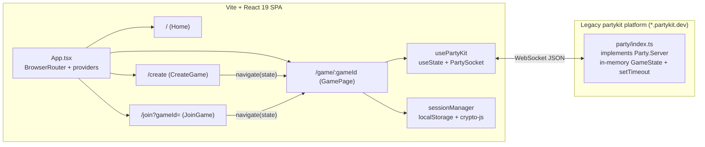

# Pokero — TanStack Migration Plan

> Status: Proposal · Scope: `src/` (client) **and** `party/` (server runtime)
> Target libraries: **TanStack Router** (adopt), **TanStack Store** (adopt, scoped), **PartyServer on Cloudflare Workers** (adopt — replaces the legacy `partykit` runtime), **TanStack Query** (conditional — adopt only with Phase 6), plus supporting tooling.

---

## 1. Executive summary

Pokero is a small, well-structured Vite + React 19 SPA with four routes and a single real-time
data source (a PartyKit WebSocket room). The current stack (`react-router-dom` v7 in declarative
mode, `useState`-based socket state, `location.state` for cross-route hand-off) works, but it has
several structural weaknesses that TanStack Router and TanStack Store address directly, and a
handful of latent bugs / hygiene issues that should be fixed while we are touching the same files.

On the server side, the app still targets the **legacy `partykit` CLI/platform** (`partykit@0.0.115`,
hosted on `*.partykit.dev`). Its successor is **PartyServer** — the
[cloudflare/partykit](https://github.com/cloudflare/partykit) monorepo ("PartyKit, for Workers") —
which runs the same room-per-game model as a Durable Object inside your own Cloudflare account,
deployed with `wrangler`. The wire protocol and the `partysocket` client are unchanged, so this is a
server-side runtime swap that can proceed independently of the client work.

### Recommendation matrix

| Technology                                   | Verdict                     | Why                                                                                                                                                                                                                                                                                                                                                                                                                                                    |
| -------------------------------------------- | --------------------------- | ------------------------------------------------------------------------------------------------------------------------------------------------------------------------------------------------------------------------------------------------------------------------------------------------------------------------------------------------------------------------------------------------------------------------------------------------------ |
| **TanStack Router**                          | **Adopt**                   | Typed params/search, `beforeLoad` guards replace three ad-hoc `useEffect` redirects, `params.parse` replaces the `history.replaceState` hack, built-in `notFoundComponent`/`errorComponent`, automatic route-level code splitting (the game route pulls in `motion`, Radix dialog/sheet/dropdown primitives and the history UI that the landing page never needs).                                                                                     |
| **TanStack Store**                           | **Adopt (scoped)**          | Lift the socket + `GameState` out of the React tree into a module-level `GameClient` that writes to a store. Removes the `usePartyKit` stale-closure/re-render issues, the three `eslint-disable react-hooks/set-state-in-effect` workarounds, and lets deep children subscribe via selectors instead of 9-prop drilling through `GameHeader`.                                                                                                         |
| **PartyServer** (`partyserver` + `wrangler`) | **Adopt**                   | The `partykit` CLI/platform is legacy; `partyserver@0.5.x` is its maintained successor on Cloudflare Workers + Durable Objects. Same lifecycle hooks (`onConnect`/`onMessage`/`onClose`/`onRequest`), same `partysocket` client, but you own the deployment, get SQLite-backed storage + alarms (so a game can survive eviction), first-class `onRequest` + CORS for Phase 6, and `wrangler dev`/`vitest-pool-workers` for local dev and server tests. |
| **TanStack Query**                           | **Conditional**             | There is _no_ request/response data in the app today — all state is pushed over a WebSocket. Wrapping socket state in Query is an anti-pattern here. Adopt **only** together with Phase 6 (a PartyServer HTTP `onRequest` endpoint for "does this room exist / metadata"), where a route `loader` + Query cache is the right tool.                                                                                                                     |
| **TanStack Form**                            | **Optional / low priority** | Two forms with two to five fields each. `useState` is fine. Revisit only if Zod schemas (Phase 4) are adopted and you want schema-driven validation UI.                                                                                                                                                                                                                                                                                                |
| **Zod (shared schemas)**                     | **Adopt**                   | `party/index.ts` re-declares every type from `src/types/index.ts` by hand and re-implements validation. A `shared/` schema module imported by both sides eliminates drift and feeds TanStack Router's `validateSearch`/`params.parse` (Standard Schema support).                                                                                                                                                                                       |
| **Vitest + Testing Library**                 | **Adopt**                   | Zero tests exist. Characterization tests on `utils.ts` and `sessionManager.ts` are the safety net for the whole migration.                                                                                                                                                                                                                                                                                                                             |
| **TanStack ESLint plugins**                  | **Adopt**                   | `@tanstack/eslint-plugin-router` (and `-query` if Phase 6 lands).                                                                                                                                                                                                                                                                                                                                                                                      |

### What we are _not_ doing

- Not moving to TanStack Start / SSR. Pokero is a static SPA on Vercel with a `/(.*) → /` rewrite; that model stays (consolidating onto Workers static assets is offered as an _optional_ Phase 5c).
- Not replacing the real-time model (one Durable Object room per game, `partysocket` on the client). We swap the **runtime** underneath it (`partykit` → `partyserver`), not the protocol.
- Not restyling or restructuring UI components beyond changing how they receive data.
- Not migrating `ThemeProvider`, `Toaster`, or shadcn primitives.

---

## 2. Current-state analysis

### 2.1 Architecture at a glance



### 2.2 Routing surface

| Path            | Component              | Router APIs used                                    | Data in                                                           |
| --------------- | ---------------------- | --------------------------------------------------- | ----------------------------------------------------------------- |
| `/`             | `pages/Home.tsx`       | `Link` (in navbar/hero/cta/footer)                  | —                                                                 |
| `/create`       | `pages/CreateGame.tsx` | `Link`, `useNavigate`                               | —                                                                 |
| `/join`         | `pages/JoinGame.tsx`   | `Link`, `useNavigate`, `useSearchParams` (`gameId`) | untyped search param                                              |
| `/game/:gameId` | `pages/GamePage.tsx`   | `useParams`, `useLocation`, `useNavigate`           | `location.state: GameLocationState` (untyped at the router level) |
| _(none)_        | —                      | —                                                   | **No 404 route** — unknown URLs render a blank page               |

Files importing `react-router-dom` (10): `App.tsx`, `components/ErrorBoundary.tsx`,
`components/landing/cta-section.tsx`, `components/landing/hero-section.tsx`,
`components/layout/footer.tsx`, `components/layout/navbar.tsx`, `pages/CreateGame.tsx`,
`pages/GamePage.tsx`, `pages/JoinGame.tsx`.

### 2.3 State flows

1. **Cross-route hand-off via `location.state`.** `CreateGame`/`JoinGame` put `{ playerName, isAdmin, settings? }` in history state; `GamePage` reads it, falls back to `sessionManager`, and if neither yields a name it toasts _"Please enter your name"_ and redirects home from a `useEffect`. The `isCreateGameState` type-guard infers _create vs join_ from `isAdmin === true`, which is fragile.
2. **Game ID normalisation.** `GamePage` lower-cases the param and then calls `window.history.replaceState` directly, bypassing the router.
3. **Socket state.** `usePartyKit` holds `gameState`, `connectionState`, `error`, `retryCount` in `useState`; `sendMessage` closes over `connectionState`; callbacks are shuttled through `optionsRef`. Every `gameState` broadcast re-renders `GamePage`, recomputes ~10 `useMemo`s, and re-renders every memoised child because the derived props are new references.
4. **Reconnection is implemented twice.** `PartySocket` is built on `reconnecting-websocket` and already does exponential back-off; `usePartyKit` layers its own `scheduleReconnect` on top, creating a new `PartySocket` on every `close`.
5. **Session persistence.** `sessionManager` AES-encrypts with `VITE_SESSION_ENCRYPTION_KEY`. Anything prefixed `VITE_` is inlined into the public bundle, so this is obfuscation, not encryption. If the variable is unset, `CryptoJS.AES.encrypt(text, undefined)` throws and the code silently falls back to base64.
6. **`beforeunload` clears the session**, so a page refresh always lands the player back on `/` (see §2.4 #7). Whether that is intentional should be decided before Phase 2.
7. **Server runtime.** `party/index.ts` implements `Party.Server` from `partykit/server`, is configured by `partykit.json`, and is deployed with `npx partykit deploy` to the hosted `partykit.dev` platform (secrets `PARTYKIT_TOKEN`/`PARTYKIT_LOGIN`). The room keeps `gameState` **only in memory** and drives the 3-second reveal countdown with `setTimeout` — both are lost if the room is evicted or redeployed mid-game. `party/` is also **not type-checked** by `npm run build` (`tsconfig.json` references only `tsconfig.app.json` and `tsconfig.node.json`).

### 2.4 Issues found (fix during migration)

| #   | Issue                                                                                                                                                                                              | Where                                    | Phase |
| --- | -------------------------------------------------------------------------------------------------------------------------------------------------------------------------------------------------- | ---------------------------------------- | ----- |
| 1   | `baseUrl`/`paths` are **outside** `compilerOptions`, so the `@/` alias configured in `vite.config.ts` and `components.json` does not type-check. Whole codebase uses relative imports as a result. | `tsconfig.app.json`                      | 0     |
| 2   | `http@0.0.1-security` is an npm placeholder package (not a real module) and `ws` is a Node server lib — neither is imported anywhere.                                                              | `package.json`                           | 0     |
| 3   | `next-themes` is only used by `components/ui/sonner.tsx`, but the app uses its own `ThemeProvider`; `useTheme()` from next-themes therefore always returns `system`.                               | `components/ui/sonner.tsx`               | 0     |
| 4   | `countdown-overlay.tsx` imports `framer-motion`, which is not a direct dependency (only `motion` is). Works transitively today; should be `motion/react`.                                          | `components/game/countdown-overlay.tsx`  | 0     |
| 5   | Both the `radix-ui` meta-package and ten individual `@radix-ui/react-*` packages are installed.                                                                                                    | `package.json`                           | 0     |
| 6   | `eslint-plugin-react-refresh` installed but not wired into `eslint.config.js`.                                                                                                                     | `eslint.config.js`                       | 0     |
| 7   | No 404 route.                                                                                                                                                                                      | `App.tsx`                                | 1     |
| 8   | `useErrorHandler` takes `useNavigate` as an effect dependency but never uses it.                                                                                                                   | `components/ErrorBoundary.tsx`           | 1     |
| 9   | Direct `window.history.replaceState` for gameId normalisation.                                                                                                                                     | `pages/GamePage.tsx`                     | 2     |
| 10  | Three `// eslint-disable-next-line react-hooks/set-state-in-effect` and one `react-hooks/immutability` suppressions in socket/join logic.                                                          | `GamePage.tsx`, `usePartyKit.ts`         | 3     |
| 11  | Duplicate reconnection logic (see §2.3 #4).                                                                                                                                                        | `lib/usePartyKit.ts`                     | 3     |
| 12  | Types + validation duplicated between client and server.                                                                                                                                           | `party/index.ts` vs `src/types/index.ts` | 4     |
| 13  | Client-side "encryption" with a public key (see §2.3 #5).                                                                                                                                          | `lib/sessionManager.ts`                  | 4     |
| 14  | `partysocket` pinned to exact `1.1.6` (latest 1.3.x).                                                                                                                                              | `package.json`                           | 3     |
| 15  | Server targets the legacy `partykit` CLI/platform (`0.0.115`); successor is `partyserver` on Cloudflare Workers.                                                                                   | `party/index.ts`, `partykit.json`, CI    | 5     |
| 16  | `party/` excluded from `tsc -b`; server type errors only surface at `partykit dev/deploy` time.                                                                                                    | `tsconfig.json`                          | 5     |
| 17  | Game state and countdown timer live only in room memory; lost on eviction/redeploy.                                                                                                                | `party/index.ts`                         | 5b    |

---

## 3. Target architecture

```mermaid
flowchart LR
  subgraph Routes [src/routes — file-based, code-split]
    Root[__root.tsx<br/>providers · Outlet · notFound · error]
    Index[index.tsx]
    CreateR[create.tsx]
    JoinR["join.tsx<br/>validateSearch(zod)"]
    GameR["game.$gameId.tsx<br/>params.parse · beforeLoad guard"]
    Root --> Index & CreateR & JoinR & GameR
  end
  subgraph State [src/lib + src/stores]
    Client[game-client.ts<br/>PartySocket lifecycle]
    Store[(gameStore<br/>@tanstack/store)]
    Derived[(derived stores<br/>players · allVoted · stats)]
    SessionM[sessionManager.ts]
    Client --> Store --> Derived
  end
  subgraph Shared [shared/]
    Schema[schema.ts — zod<br/>GameSettings · messages · ids]
  end
  subgraph Worker ["Cloudflare Worker (wrangler)"]
    Router["fetch → routePartykitRequest()"]
    Party["PokeroServer extends Server<br/>(Durable Object, SQLite-backed)"]
    Storage[(ctx.storage<br/>gameState · alarm)]
    Router --> Party --> Storage
  end
  GameR -- "useSelector" --> Store & Derived
  GameR --> Client
  CreateR & JoinR -- "savePlayerSession() then navigate" --> SessionM
  GameR -- "beforeLoad reads" --> SessionM
  Client <-- "WS /parties/pokero-server/:gameId" --> Router
  Party --> Schema
  Routes --> Schema
```

Key design decisions:

- **Session-first hand-off.** Create/Join write the session _before_ navigating; the game route reads only from `sessionManager`. `GameLocationState`, `isCreateGameState`, and `usePlayerInfo` are deleted. The `/game/$gameId` `beforeLoad` redirects to `/join?gameId=…` when no session exists — a better UX than "toast + home".
- **Route guards are pure.** `beforeLoad`/`loader` never open sockets. The socket connects in the route component's effect (or a `useGameConnection(gameId)` hook) so preloading and `beforeLoad` re-runs are side-effect free.
- **One store, small surface.** `gameStore` holds `{ connectionState, gameState, error, retryCount }`. Server _events_ (`playerLeft`, `playerKicked`, `gameEnded`, `adminTransferred`) are not state; they go through a tiny typed emitter on `gameClient` so components can toast/navigate.
- **Components keep their prop APIs in Phase 3.** `GamePage` becomes a thin adapter that reads via selectors. Pushing selectors _into_ `GameHeader` etc. is an optional follow-up (Phase 3b).
- **Server: same protocol, new runtime.** `PokeroServer extends Server` from `partyserver`, addressed at `/parties/pokero-server/:gameId`. The wire format (`ClientMessage`/`ServerMessage` JSON) is untouched, so client and server phases can ship in either order. Persistence (`ctx.storage`) and alarms are added as a second step so the initial port is a 1:1 behavioural match.

---

## 4. Phased plan

Each phase is one PR, independently shippable, and leaves `npm run build && npm run lint` green.
Sizing is relative (S/M/L), not a time estimate.

**Ordering.** Phases 0 → 4 are the client track and build on each other. Phase 5 (PartyServer) is
independent of 1–3 and can run in parallel; it is placed after Phase 4 so the new server is written
against `shared/schema.ts` from day one. If moving off `partykit.dev` is urgent, pull Phase 5
forward to directly after Phase 0 (it only needs the wire types, which already exist). Phase 6
(Query) depends on Phase 5's `onRequest` endpoint.

### Phase 0 — Safety net & hygiene (S)

**Goal:** make later phases verifiable and remove noise from the diff.

1. **Fix `tsconfig.app.json`** — move `baseUrl`/`paths` inside `compilerOptions`. Optionally run a codemod to switch `../components/...` → `@/components/...` (or leave for later; not required).
2. **Add Vitest + Testing Library.**
   - `npm i -D vitest @vitest/coverage-v8 jsdom @testing-library/react @testing-library/user-event @testing-library/jest-dom`
   - `vite.config.ts` → add `test: { environment: 'jsdom', setupFiles: './src/test/setup.ts', globals: false }`.
   - Scripts: `"test": "vitest run"`, `"test:watch": "vitest"`.
   - **Characterization tests** (lock current behaviour): `calculateRoundStats`, `validate*`, `normalizeGameId`, `calculateBackoffDelay`, `generateShareUrl`; `sessionManager` save/get/expire/clearAll with a mocked `Date.now`.
3. **Dependency cleanup.**
   - Remove: `http`, `ws`, `next-themes`, `recharts` (never imported), `crypto-js` + `@types/crypto-js` _(only if Phase 4 §13 is accepted; otherwise defer)_.
   - Fix `sonner.tsx` to use `useTheme` from `@/components/theme-provider`.
   - Change `framer-motion` import → `motion/react` in `countdown-overlay.tsx`.
   - Decide on `radix-ui` meta-package **or** individual packages; shadcn's current generator uses the meta-package, so prefer that and drop the ten `@radix-ui/react-*` entries (update imports in `components/ui/*`).
   - Bump `partysocket` to `^1.3.0` (remove exact pin).
4. **ESLint.** Wire `eslint-plugin-react-refresh` (`react-refresh/only-export-components: warn` — important once route files export both `Route` and components; see Phase 1 note).
5. **Baseline metrics.** Record `vite build` output sizes for `index-*.js` to compare after code splitting.

**Acceptance:** `npm run test` passes; `npm run build` unchanged in behaviour; bundle baseline recorded in the PR description.

---

### Phase 1 — TanStack Router (M)

**Goal:** replace `react-router-dom` 1:1 with file-based TanStack Router, preserving all URLs and behaviour.

#### 1.1 Install

```bash
npm i @tanstack/react-router
npm i -D @tanstack/router-plugin @tanstack/react-router-devtools @tanstack/eslint-plugin-router
npm un react-router-dom
```

#### 1.2 Vite plugin (must precede `react()`)

```ts
// vite.config.ts
import { tanstackRouter } from '@tanstack/router-plugin/vite';

export default defineConfig({
  plugins: [tanstackRouter({ target: 'react', autoCodeSplitting: true }), react(), tailwindcss()],
  // …
});
```

#### 1.3 Route files

| Current                          | New file                      | Notes                                                                                                                                                                                                                                                                         |
| -------------------------------- | ----------------------------- | ----------------------------------------------------------------------------------------------------------------------------------------------------------------------------------------------------------------------------------------------------------------------------- |
| `App.tsx` providers + `<Routes>` | `src/routes/__root.tsx`       | `createRootRoute({ component: RootLayout, notFoundComponent, errorComponent })`. Providers (`ThemeProvider`, `TooltipProvider`, `Toaster`), `<Outlet />`, `<TanStackRouterDevtools />` (dev only). `clearAllExpiredSessions()` moves to `main.tsx` (run once, before render). |
| `pages/Home.tsx`                 | `src/routes/index.tsx`        | `createFileRoute('/')({ component: Home })`                                                                                                                                                                                                                                   |
| `pages/CreateGame.tsx`           | `src/routes/create.tsx`       |                                                                                                                                                                                                                                                                               |
| `pages/JoinGame.tsx`             | `src/routes/join.tsx`         | `validateSearch` — see Phase 2 (Phase 1 can use a hand-written `(s) => ({ gameId: typeof s.gameId === 'string' ? s.gameId : undefined })`).                                                                                                                                   |
| `pages/GamePage.tsx`             | `src/routes/game.$gameId.tsx` |                                                                                                                                                                                                                                                                               |
| _(none)_                         | root `notFoundComponent`      | Fixes §2.4 #7.                                                                                                                                                                                                                                                                |

Keep the page components where they are (`src/pages/*`) and have route files import them — smallest diff, and it keeps `react-refresh/only-export-components` happy. Move them later if desired.

#### 1.4 Router bootstrap

```tsx
// src/router.tsx
import { createRouter } from '@tanstack/react-router';
import { routeTree } from './routeTree.gen';

export const router = createRouter({
  routeTree,
  defaultPreload: 'intent',
  scrollRestoration: true,
});

declare module '@tanstack/react-router' {
  interface Register {
    router: typeof router;
  }
}
```

```tsx
// src/main.tsx
clearAllExpiredSessions();
createRoot(document.getElementById('root')!).render(
  <StrictMode>
    <ErrorBoundary>
      <RouterProvider router={router} />
    </ErrorBoundary>
  </StrictMode>,
);
```

#### 1.5 API cheat-sheet (react-router → TanStack)

| react-router-dom                     | TanStack Router                                                                                |
| ------------------------------------ | ---------------------------------------------------------------------------------------------- |
| `<Link to="/create">`                | `<Link to="/create">` (typed; unknown paths are compile errors)                                |
| `navigate('/game/' + id, { state })` | `navigate({ to: '/game/$gameId', params: { gameId } })` — _state hand-off replaced in Phase 2_ |
| `useParams<{ gameId: string }>()`    | `Route.useParams()` (typed from the file name)                                                 |
| `useSearchParams().get('gameId')`    | `Route.useSearch().gameId`                                                                     |
| `useLocation().state`                | `useRouterState({ select: s => s.location.state })` — _removed in Phase 2_                     |
| `useNavigate()`                      | `useNavigate()` (returns object-arg function)                                                  |
| `<Routes>/<Route>`                   | file tree + `routeTree.gen.ts`                                                                 |

#### 1.6 Housekeeping

- **Commit `src/routeTree.gen.ts`.** `npm run build` runs `tsc -b` _before_ `vite build`, so the file must exist in CI. Add it to `.prettierignore` and ESLint `ignores`.
- `useErrorHandler` in `ErrorBoundary.tsx`: drop the `useNavigate` import/dependency (§2.4 #8). Wire the class `ErrorBoundary` UI as the root route's `errorComponent` too (or pass it via `defaultErrorComponent` in `createRouter`).
- Add `@tanstack/eslint-plugin-router` recommended rules to `eslint.config.js`.
- `vercel.json` needs no change (SPA rewrite already in place).

**Acceptance:**

- All four URLs work, including direct load and `/join?gameId=ABC` pre-fill.
- Unknown URL renders the not-found component.
- `dist/` shows separate chunks for `game.$gameId` (should contain `motion`, Radix dialog/sheet/dropdown) vs the landing route; record sizes against Phase 0 baseline.
- `grep -r "react-router-dom" src` returns nothing.

**Rollback:** revert the PR. No data migrations; URLs unchanged.

---

### Phase 2 — Session-first navigation & route guards (S)

**Goal:** remove `location.state` hand-off and the effect-based redirects; make `/game/$gameId` self-validating.

1. **Create/Join write the session before navigating.**

   ```ts
   // CreateGame.handleCreate
   const gameId = generateGameId();
   savePlayerSession(gameId, generatePlayerId(), playerName, /* isAdmin */ true, settings);
   navigate({ to: '/game/$gameId', params: { gameId } });
   ```

   `JoinGame` does the same with `isAdmin: false`. The `settings` are already persisted per-session, so `GamePage`'s "apply initial settings for admin" effect keeps working unchanged (reads `existingSession.settings`).

2. **Game route: parse params + guard.**

   ```ts
   export const Route = createFileRoute('/game/$gameId')({
     params: {
       parse: ({ gameId }) => ({ gameId: normalizeGameId(gameId) }),
       stringify: ({ gameId }) => ({ gameId }),
     },
     beforeLoad: ({ params }) => {
       if (!VALIDATION_CONFIG.GAME_ID_PATTERN.test(params.gameId)) throw notFound();
       const session = getPlayerSession(params.gameId);
       if (!session) throw redirect({ to: '/join', search: { gameId: params.gameId } });
       return { session }; // available via Route.useRouteContext()
     },
     component: GamePage,
   });
   ```

   _Note:_ `params.parse` normalises for matching but does **not** rewrite the URL. If canonical lower-case URLs are desired, add: `if (rawGameId !== normalized) throw redirect({ to: '/game/$gameId', params: { gameId: normalized }, replace: true })` inside `beforeLoad` using `location.pathname`. This replaces the `history.replaceState` hack (§2.4 #9).

3. **Join route: typed search.**

   ```ts
   validateSearch: (s) => ({
     gameId: typeof s.gameId === 'string' ? normalizeGameId(s.gameId) : undefined,
   });
   ```

   (Swap for a Zod schema in Phase 4 — TanStack Router accepts Standard Schema validators directly.)

4. **Delete:** `GameLocationState`, `CreateGameLocationState`, `JoinGameLocationState`, `isCreateGameState` (types), `usePlayerInfo` hook, the _"Please enter your name"_ effect, the `replaceState` effect.

5. **Decision required — `beforeunload` clears session.** With guards in place, refreshing now redirects to `/join?gameId=…` (name pre-filled is not possible because the session is gone). If the intent is to _support_ refresh/reconnect (which `sessionManager`'s 24h TTL and `usePartyKit`'s `id: playerId` strongly suggest), remove the `beforeunload` handler; the server already removes the player on socket close, and the rejoin with the same `playerId` restores them. Either way, document the choice in the PR.

**Acceptance:**

- Create → game, Join → game, share link → join (pre-filled) → game all work.
- Direct `/game/xyz` with no session → `/join?gameId=xyz`.
- `/game/NOT-VALID!` → not found.
- No `location.state` usage remains; `src/types/index.ts` no longer exports `*LocationState`.

---

### Phase 3 — TanStack Store: `GameClient` + `gameStore` (M)

**Goal:** move the socket lifecycle and game state out of the component tree; subscribe via selectors.

#### 3.1 Install

```bash
npm i @tanstack/react-store   # pulls @tanstack/store
```

#### 3.2 Store + client

```ts
// src/stores/game-store.ts
import { createStore } from '@tanstack/store';

export interface GameConnection {
  connectionState: ConnectionState;
  gameState: GameState | null;
  error: GameError | null;
  retryCount: number;
}

export const gameStore = createStore<GameConnection>({
  connectionState: ConnectionState.DISCONNECTED,
  gameState: null,
  error: null,
  retryCount: 0,
});

// Derived stores auto-track dependencies (@tanstack/store ≥ 0.8)
export const playersStore = createStore(() =>
  Object.values(gameStore.state.gameState?.players ?? {}),
);
export const allVotedStore = createStore(() =>
  playersStore.state.filter((p) => !p.isSpectator).every((p) => p.hasVoted),
);
export const countingDown = createStore(() => {
  const g = gameStore.state.gameState;
  return g?.countdownEnd != null && !g.votesRevealed;
});
export const roundStats = createStore(() => {
  const g = gameStore.state.gameState;
  return g?.votesRevealed ? calculateRoundStats(g) : null;
});
```

```ts
// src/lib/game-client.ts
type GameEvents = {
  playerLeft: (name: string) => void;
  playerKicked: (name: string, by: string, wasMe: boolean) => void;
  gameEnded: (by: string) => void;
  adminTransferred: (from: string, to: string, iAmNewAdmin: boolean) => void;
};

export const gameClient = {
  connect(roomId: string, playerId: string): void,   // creates PartySocket, wires listeners → gameStore.setState
  disconnect(): void,
  reconnect(): void,
  send(message: ClientMessage): void,               // guards on gameStore.state.connectionState
  on<K extends keyof GameEvents>(event: K, cb: GameEvents[K]): () => void,
};
```

- **Reconnection:** delete `scheduleReconnect`; configure `PartySocket` with `{ maxRetries: RECONNECTION_CONFIG.MAX_RETRIES, minReconnectionDelay, maxReconnectionDelay, reconnectionDelayGrowFactor }` (its `reconnecting-websocket` base handles back-off). Track `retryCount` from the socket's `retryCount` property on `close`/`open` (§2.4 #11).
- Validate inbound `ServerMessage` with the shared Zod schema once Phase 4 lands.

#### 3.3 React binding

```ts
// src/lib/useGameConnection.ts
export function useGameConnection(gameId: string, playerId: string) {
  useEffect(() => {
    gameClient.connect(gameId, playerId);
    return () => gameClient.disconnect();
  }, [gameId, playerId]);
}
```

In `GamePage`:

```ts
const { session } = Route.useRouteContext();
useGameConnection(gameId, session.playerId);

const connectionState = useSelector(gameStore, (s) => s.connectionState);
const settings = useSelector(gameStore, (s) => s.gameState?.settings);
const me = useSelector(gameStore, (s) => s.gameState?.players[session.playerId] ?? null);
const players = useSelector(playersStore, (p) => p);
const allVoted = useSelector(allVotedStore, (v) => v);
// …
```

Event subscriptions (`gameClient.on('gameEnded', …)`) replace the `onGameEnded`/`onPlayerKicked`/… option callbacks; register them in a `useEffect` and return the unsubscribe.

#### 3.4 Join / initial-settings logic

Move the "send `join` on first `CONNECTED`" and "apply initial admin settings once" logic into `gameClient.connect()` (it has everything it needs: session + first `gameState` message). This deletes `hasJoined`, `settingsApplied`, `isReconnecting` state and the `set-state-in-effect` suppressions (§2.4 #10). Reconnect toasts fire from the `open` handler when `retryCount > 0`.

#### 3.5 Component props (unchanged in this phase)

`GameHeader`, `VoteStatusCards`, `VotingCards`, `RoundStats`, `CountdownOverlay` keep their current props. `GamePage` becomes an adapter. Because selectors return stable primitives/references where unchanged, the `memo()` wrappers now actually prevent re-renders.

**Phase 3b (optional):** let `GameHeader`/`GameSettings`/`GameHistory` read `settings`/`history` via `useSelector` directly and call `gameClient.send(...)`, removing ~6 props. Do this only if prop-drilling becomes a maintenance pain; the adapter approach is already a net improvement.

**Acceptance:**

- Vote / reveal / new round / settings / kick / transfer / leave / end game behave identically (manual matrix with two browser tabs).
- Kill the server dev process mid-game → reconnect toast on restart; retry counter increments; `FAILED` state after `MAX_RETRIES`.
- `usePartyKit.ts` deleted; no `eslint-disable` for `react-hooks/*` remains in `src/pages`/`src/lib`.
- React DevTools profiler: a `gameState` broadcast that changes only one player's `hasVoted` does not re-render `GameHeader`.

---

### Phase 4 — Shared schemas & server alignment (M)

**Goal:** one source of truth for wire types and validation; typed search/params via Standard Schema.

1. **Install** `npm i zod` (v4; ~2 kB core with `zod/mini` if bundle matters).
2. **Create `shared/schema.ts`** (repo root, sibling of `party/` and `src/`):
   - `VotingTypeSchema`, `GameSettingsSchema`, `PlayerSchema`, `GameStateSchema`, `RoundHistoryEntrySchema`
   - `ClientMessageSchema` / `ServerMessageSchema` as `z.discriminatedUnion('type', …)`
   - `GameIdSchema = z.string().trim().toLowerCase().regex(/^[a-z0-9]{5,15}$/)`
   - `PlayerNameSchema`, `GameNameSchema` with the existing max lengths
   - `export type GameSettings = z.infer<typeof GameSettingsSchema>` etc.
3. **Wire it up.**
   - `src/types/index.ts` re-exports the inferred types (keep the constants like `CARD_VALUES_BY_TYPE`, `DEFAULT_GAME_SETTINGS`, `RECONNECTION_CONFIG`).
   - `party/index.ts` deletes its local interfaces; `onMessage` does `ClientMessageSchema.safeParse(JSON.parse(message))` and rejects invalid payloads with `sendError`. Server-side `sanitizeName`/`isValidVote`/`isValidVotingType` collapse into the schema.
   - `tsconfig.app.json` `include: ["src", "shared"]`; both the legacy `partykit` bundler and `wrangler` (esbuild) bundle TS imports from `../shared` without extra config.
   - Router: `join.tsx` → `validateSearch: z.object({ gameId: GameIdSchema.optional().catch(undefined) })`; `game.$gameId.tsx` → `params: { parse: z.object({ gameId: GameIdSchema }).parse }` (throws → router error/not-found boundary).
   - `game-client.ts`: `ServerMessageSchema.safeParse` on inbound messages.
4. **Session storage (§2.4 #13).** Replace crypto-js AES with plain `JSON.stringify` in `localStorage` (data is non-sensitive: display name, admin flag, settings). Validate on read with a `PlayerSessionSchema`. Remove `VITE_SESSION_ENCRYPTION_KEY` from CI/Vercel env and `crypto-js` from deps. If any encryption is still wanted, use Web Crypto — but note a client-held key cannot protect against the client.
5. **Optional — TanStack Form.** If adopted, `useForm({ validators: { onSubmit: CreateGameFormSchema } })` replaces the `validateCreateGameForm`/`validateJoinGameForm` helpers. Not required; `useState` + schema `.safeParse` on submit is equally fine for these forms.

**Acceptance:**

- `npm run build` and the server dev command (`npx partykit dev`, or `npx wrangler dev` after Phase 5) both type-check against `shared/schema.ts`.
- Sending a malformed message via a raw WebSocket client gets `{ type: 'error' }` back instead of a thrown exception in the room.
- Characterization tests from Phase 0 still pass (validation messages unchanged).

---

### Phase 5 — PartyKit → PartyServer on Cloudflare Workers (M)

**Goal:** replace the legacy `partykit` runtime/platform with `partyserver` (from
[cloudflare/partykit](https://github.com/cloudflare/partykit)) running as a Durable Object in your
own Cloudflare account, deployed with `wrangler`. **Behaviour and wire protocol are unchanged** in
5a; durability and hibernation come in 5b; hosting consolidation is an optional 5c.

> The upstream `docs/guides/migrating-from-partykit.md` is an empty stub, so the mapping below is
> derived from the `partyserver` README and source (`packages/partyserver/src/index.ts`).

#### 5a — 1:1 runtime port

**5a.1 Install**

```bash
npm i partyserver
npm i -D wrangler
npm un partykit
```

**5a.2 API mapping (`partykit/server` → `partyserver`)**

| Legacy `partykit`                                                                           | `partyserver`                                                                                                         | Notes                                                                                                                               |
| ------------------------------------------------------------------------------------------- | --------------------------------------------------------------------------------------------------------------------- | ----------------------------------------------------------------------------------------------------------------------------------- |
| `import type * as Party from 'partykit/server'`                                             | `import { Server, routePartykitRequest, type Connection, type ConnectionContext, type WSMessage } from 'partyserver'` |                                                                                                                                     |
| `export default class X implements Party.Server { constructor(readonly room: Party.Room) }` | `export class PokeroServer extends Server<Env> { }` **plus** a default `fetch` export (below)                         | Class is a Durable Object; must be a named export matching the wrangler binding.                                                    |
| `this.room.id`                                                                              | `this.name`                                                                                                           | Populated from `ctx.id.name` (routed via `idFromName`).                                                                             |
| `this.room.broadcast(msg)`                                                                  | `this.broadcast(msg, excludeIds?)`                                                                                    | **Collision:** the existing private `broadcast()` helper (line ~580) must be renamed, e.g. `broadcastGameState()`.                  |
| `this.room.getConnections()` / `getConnection(id)`                                          | `this.getConnections()` / `this.getConnection(id)`                                                                    |                                                                                                                                     |
| `this.room.storage`                                                                         | `this.ctx.storage` (+ `this.sql` tagged-template helper)                                                              | SQLite-backed when declared in `new_sqlite_classes`. Used in 5b.                                                                    |
| `onConnect(conn, ctx)`                                                                      | `onConnect(connection, ctx)`                                                                                          | Same shape; `ctx.request` available.                                                                                                |
| `onMessage(message: string, sender)`                                                        | `onMessage(connection, message: WSMessage)`                                                                           | **Argument order swapped**; `message` may be `string \| ArrayBuffer \| ArrayBufferView` — guard with `typeof message === 'string'`. |
| `onClose(conn)`                                                                             | `onClose(connection, code, reason, wasClean)`                                                                         |                                                                                                                                     |
| `onError(conn, err)`                                                                        | `onError(connection, error)`                                                                                          |                                                                                                                                     |
| `onRequest(req)`                                                                            | `onRequest(request)`                                                                                                  | Used in Phase 6.                                                                                                                    |
| `onAlarm()` / `room.storage.setAlarm()`                                                     | `onAlarm()` / `this.ctx.storage.setAlarm()`                                                                           | Used in 5b.                                                                                                                         |
| `conn.id` (from `PartySocket({ id })`)                                                      | `connection.id`                                                                                                       | PartyServer reads the same `_pk` query param, so `playerId`-as-connection-id keeps working.                                         |
| `partykit.json`                                                                             | `wrangler.jsonc`                                                                                                      | Bindings + migrations are explicit (see below).                                                                                     |
| URL `/party/:room` (main) or `/parties/:party/:room`                                        | `/parties/<kebab-binding>/:room`                                                                                      | Binding `PokeroServer` → `pokero-server`. There is **no implicit `main`**; the client must pass `party`.                            |
| `npx partykit dev` (port 1999)                                                              | `npx wrangler dev` (port 8787)                                                                                        | Or Vite-integrated via `@cloudflare/vite-plugin` (5c).                                                                              |
| `npx partykit deploy` (`PARTYKIT_TOKEN`, `PARTYKIT_LOGIN`)                                  | `npx wrangler deploy` (`CLOUDFLARE_API_TOKEN`, `CLOUDFLARE_ACCOUNT_ID`)                                               | Host becomes `pokero-party.<account>.workers.dev` or a custom domain.                                                               |

**5a.3 `wrangler.jsonc`** (replaces `partykit.json`)

```jsonc
{
  "$schema": "node_modules/wrangler/config-schema.json",
  "name": "pokero-party",
  "main": "party/index.ts",
  "compatibility_date": "2026-09-01",
  "durable_objects": {
    "bindings": [{ "name": "PokeroServer", "class_name": "PokeroServer" }],
  },
  "migrations": [{ "tag": "v1", "new_sqlite_classes": ["PokeroServer"] }],
  "observability": { "enabled": true },
}
```

**5a.4 Server skeleton** (game logic body is copied verbatim; only the shell changes)

```ts
// party/index.ts
import { Server, routePartykitRequest, type Connection, type WSMessage } from 'partyserver';
import { ClientMessageSchema } from '../shared/schema'; // Phase 4

export class PokeroServer extends Server<Env> {
  private gameState: GameState | null = null;
  private countdownTimer: ReturnType<typeof setTimeout> | null = null; // replaced by alarm in 5b

  onConnect(conn: Connection) {
    if (this.gameState) this.sendToConnection(conn, { type: 'gameState', state: this.gameState });
  }

  onMessage(sender: Connection, raw: WSMessage) {
    if (typeof raw !== 'string') return;
    const parsed = ClientMessageSchema.safeParse(JSON.parse(raw));
    if (!parsed.success) return this.sendError(sender, 'Invalid message format.');
    this.handleClientMessage(parsed.data, sender);
  }

  onClose(conn: Connection) {
    this.handleLeave(conn.id);
  }

  private broadcastGameState() {
    if (this.gameState)
      this.broadcast(JSON.stringify({ type: 'gameState', state: this.gameState }));
  }
  // …handleJoin / handleVote / handleReveal / … unchanged, with this.room.id → this.name
}

export default {
  async fetch(request, env) {
    return (
      (await routePartykitRequest(request, env, { cors: true })) ??
      new Response('Not Found', { status: 404 })
    );
  },
} satisfies ExportedHandler<Env>;
```

**5a.5 Client change (one line)**

```ts
// src/lib/game-client.ts (or usePartyKit.ts if Phase 3 has not landed)
new PartySocket({ host: PARTYKIT_HOST, party: 'pokero-server', room: roomId, id: playerId });
```

Without `party`, PartyServer logs _"You appear to be migrating a PartyKit project…"_ and returns 400.

**5a.6 Type-checking the server (fixes §2.4 #16)**

- `npx wrangler types` → generates `worker-configuration.d.ts` (global `Env` with `PokeroServer: DurableObjectNamespace<PokeroServer>` plus runtime types for the chosen `compatibility_date`). Commit it; add `"types": "wrangler types"` script and run it in `prepare`/CI.
- New `tsconfig.worker.json`: `include: ["party", "shared", "worker-configuration.d.ts"]`, `"types": []`, `noEmit`, `strict`. Add to `tsconfig.json` `references` so `tsc -b` covers the server.
- Drop `@cloudflare/workers-types` in favour of the generated file (current wrangler guidance).

**5a.7 Scripts & CI**

```jsonc
"party": "wrangler dev",
"deploy:party": "wrangler deploy",
"types": "wrangler types"
```

`.github/workflows/deploy.yml` job 1 becomes `cloudflare/wrangler-action@v3` (`apiToken: ${{ secrets.CLOUDFLARE_API_TOKEN }}`, `accountId: ${{ secrets.CLOUDFLARE_ACCOUNT_ID }}`). `VITE_PARTYKIT_HOST` (Vercel + GH secret) changes to the Worker hostname. Optionally rename the env var to `VITE_PARTY_HOST` — if so, do it in the same PR and update both places.

**5a.8 Server tests** (`@cloudflare/vitest-pool-workers`)

- Separate project via `vitest.workspace.ts`: the jsdom project from Phase 0 for `src/`, and a `defineWorkersConfig({ test: { poolOptions: { workers: { wrangler: { configPath: './wrangler.jsonc' } } } } })` project for `party/`.
- Tests drive the DO through `env.PokeroServer.get(env.PokeroServer.idFromName('room'))` + `fetch` with `Upgrade: websocket`, or unit-test extracted pure reducers (`captureRoundHistory`, admin-transfer rules). Recommend extracting the pure game-state transitions into `shared/game-logic.ts` first so most tests need no Worker runtime at all.

**Acceptance (5a):**

- `npx wrangler dev` + `VITE_PARTYKIT_HOST=localhost:8787 npm run dev` → full manual matrix (§8) passes.
- Reconnect with the same `playerId` after a socket drop restores the player (verifies `_pk` handling).
- `tsc -b` now reports errors in `party/`; `grep -r "partykit/server" .` is empty; `partykit.json` deleted.
- Deployed Worker reachable at `wss://<host>/parties/pokero-server/<gameId>`; production Vercel build points at it.

**Rollback:** keep the `partykit.dev` deployment live until the Worker has run in production for a while; rolling back is a `VITE_PARTYKIT_HOST` change + removing `party:` from the client.

#### 5b — Durable state, alarms, hibernation (S–M)

Fixes §2.4 #17 and unlocks the free-tier-friendly hibernation model.

1. **Persist `gameState`.** `onStart()` → `this.gameState = await this.ctx.storage.get<GameState>('game') ?? null`. After every mutation (`broadcastGameState()` is the natural choke point) → `await this.ctx.storage.put('game', this.gameState)`. `handleEndGame` → `await this.ctx.storage.deleteAll()`.
2. **Replace the countdown `setTimeout` with an alarm.** `handleReveal` sets `countdownEnd` and `await this.ctx.storage.setAlarm(countdownEnd)`; `onAlarm()` runs the body of the current timer callback (reveal + `captureRoundHistory` + broadcast). `handleNewRound`/`handleEndGame` → `this.ctx.storage.deleteAlarm()`. Behaviour is identical (`COUNTDOWN_DURATION_MS` unchanged) but survives eviction.
3. **Enable hibernation** once nothing depends on in-memory timers: `static options = { hibernate: true }`. Connections are rehydrated by the runtime; `onStart()` reloads state. Keep the per-connection data model as-is (player identity is keyed by `connection.id`, which is stable across hibernation).
4. **Reconsider `onClose` → `handleLeave`.** With hibernation, a transient drop still fires `onClose`. Current behaviour (remove player immediately, reassign admin) is preserved; if Phase 2 chose "refresh = reconnect", consider a short grace period via a per-player alarm or by marking the player `disconnected` instead of deleting — an optional follow-up, not required here.

**Acceptance (5b):** in `wrangler dev`, reveal a round, kill and restart the dev server during the 3s countdown → reconnecting clients see the round revealed with correct history; `wrangler tail` shows no `setTimeout` usage; storage inspected via `wrangler d1`-style local `.wrangler/state` shows the `game` key.

#### 5c — Optional: consolidate hosting on Workers (S)

If you would rather run one deployable instead of Vercel + Worker:

- `npm i -D @cloudflare/vite-plugin`; `vite.config.ts` plugins → `[cloudflare(), tanstackRouter(…), react(), tailwindcss()]`. `vite dev` then runs the Worker in `workerd` alongside the SPA on one origin (no `VITE_PARTYKIT_HOST`; `PartySocket` defaults `host` to `window.location.host`).
- `wrangler.jsonc` gains `"assets": { "directory": "./dist/client", "not_found_handling": "single-page-application" }`; the Worker's `fetch` only needs to handle `/parties/*` (assets are served first).
- Delete `vercel.json`; CI collapses to `vite build && wrangler deploy`.

Trade-offs: gains single-origin (no CORS, one env), loses Vercel preview deployments unless you add `wrangler versions upload` per PR. Decide in §7.

---

### Phase 6 — TanStack Query (conditional, S–M)

**Adopt only if** you add HTTP endpoints to the game room (now trivial on PartyServer). The motivating feature: today, _joining a non-existent game silently creates it_ and makes the joiner admin (`handleJoin` → `createInitialGameState`). A pre-flight check gives a proper "Game not found" UX.

1. **Server:** implement `onRequest(request)` in `PokeroServer`:
   - `GET /parties/pokero-server/:roomId` → `200 { exists: true, gameName, playerCount, votingType }` or `404`. Cross-origin from `pokero.dev` is handled by `routePartykitRequest(request, env, { cors: { 'Access-Control-Allow-Origin': 'https://pokero.dev', … } })` — tighten from the `cors: true` wildcard used in 5a.
2. **Client:**
   - `npm i @tanstack/react-query` · `npm i -D @tanstack/react-query-devtools @tanstack/eslint-plugin-query`
   - `src/lib/query-client.ts` — `new QueryClient({ defaultOptions: { queries: { staleTime: 10_000, retry: 1 } } })`
   - Root route becomes `createRootRouteWithContext<{ queryClient: QueryClient }>()`; pass `context: { queryClient }` to `createRouter`; wrap `RouterProvider` in `QueryClientProvider`.
   - `src/queries/game.ts` — `gameQueries.meta(gameId) = queryOptions({ queryKey: ['game', gameId, 'meta'], queryFn: () => fetch(\`https://${PARTYKIT_HOST}/parties/pokero-server/${gameId}\`).then(…) })`
   - `join.tsx` `loaderDeps: ({ search }) => ({ gameId: search.gameId })`, `loader: ({ context, deps }) => deps.gameId ? context.queryClient.ensureQueryData(gameQueries.meta(deps.gameId)) : null` — the join card can show "Joining **Sprint 42** (3 players)" or "Game not found".
   - `game.$gameId.tsx` `loader` can `ensureQueryData` the same key to fail fast before opening a socket.
3. **Do not** put `gameState` into Query. It stays in `gameStore` (Phase 3). Query is for request/response only.

**Acceptance:** `/join?gameId=doesnotexist` shows a not-found message without touching the WebSocket; devtools show the `['game', id, 'meta']` entry.

---

### Phase 7 — Cleanup & docs (S)

- Delete `src/App.tsx` if fully superseded by `__root.tsx` + `main.tsx`.
- Update `README.md` "Project Structure" (`src/routes/`, `src/stores/`, `shared/`, `wrangler.jsonc`), the "Running Locally" section (`npx wrangler dev` replaces `npx partykit dev`; note the port change 1999 → 8787), and the "Built With" badges (add Cloudflare Workers).
- Add `@tanstack/react-router-devtools` / `react-query-devtools` behind `import.meta.env.DEV`.
- CI (`.github/workflows/deploy.yml`): add `npm run lint`, `npm run test` and `npm run types` steps before `vite build`; remove `PARTYKIT_TOKEN`/`PARTYKIT_LOGIN` secrets; drop `VITE_SESSION_ENCRYPTION_KEY` if Phase 4 §4 landed.
- Decommission the `partykit.dev` deployment once the Worker has been stable in production.
- Record final bundle sizes vs Phase 0 baseline in the PR.

---

## 5. Dependency changes (net)

| Action              | Package                                                                                                                                   | Phase |
| ------------------- | ----------------------------------------------------------------------------------------------------------------------------------------- | ----- |
| add                 | `@tanstack/react-router` `^1.170`                                                                                                         | 1     |
| add (dev)           | `@tanstack/router-plugin` `^1.168`, `@tanstack/react-router-devtools` `^1.167`, `@tanstack/eslint-plugin-router` `^1.162`                 | 1     |
| add                 | `@tanstack/react-store` `^0.11`                                                                                                           | 3     |
| add                 | `zod` `^4.6`                                                                                                                              | 4     |
| add (conditional)   | `@tanstack/react-query` `^5.103` (+ devtools, eslint plugin)                                                                              | 6     |
| add (optional)      | `@tanstack/react-form` `^1.33`                                                                                                            | 4     |
| add (dev)           | `vitest` `^5`, `jsdom`, `@testing-library/react` `^16`, `@testing-library/user-event`, `@testing-library/jest-dom`, `@vitest/coverage-v8` | 0     |
| add                 | `partyserver` `^0.5.10`                                                                                                                   | 5     |
| add (dev)           | `wrangler` `^4.136`, `@cloudflare/vitest-pool-workers` `^0.22`                                                                            | 5     |
| add (dev, optional) | `@cloudflare/vite-plugin` `^1.57`                                                                                                         | 5c    |
| remove              | `react-router-dom`                                                                                                                        | 1     |
| remove              | `http`, `ws`, `next-themes`, `recharts`                                                                                                   | 0     |
| remove              | `crypto-js`, `@types/crypto-js`                                                                                                           | 4     |
| remove              | `partykit` (+ `partykit.json`)                                                                                                            | 5     |
| remove              | ten `@radix-ui/react-*` (keep `radix-ui`) — or the inverse                                                                                | 0     |
| bump                | `partysocket` `1.1.6` → `^1.3.0`                                                                                                          | 3     |

---

## 6. Risks & mitigations

| Risk                                                                                             | Impact                            | Mitigation                                                                                                                                                                                                                                              |
| ------------------------------------------------------------------------------------------------ | --------------------------------- | ------------------------------------------------------------------------------------------------------------------------------------------------------------------------------------------------------------------------------------------------------- |
| `routeTree.gen.ts` missing in CI → `tsc -b` fails                                                | Build red                         | Commit the generated file; add `router-plugin` `generatedRouteTree` path to lint/prettier ignores.                                                                                                                                                      |
| `react-refresh/only-export-components` complains about route files exporting `Route` + component | Lint noise                        | Keep components in `src/pages/*`; route files export only `Route`.                                                                                                                                                                                      |
| Preloading (`defaultPreload: 'intent'`) triggers `beforeLoad` on hover                           | Unwanted side effects             | Guards are pure (no socket, no toasts). Redirects thrown during preload are ignored by the router.                                                                                                                                                      |
| Derived-store auto-tracking semantics differ from `useMemo`                                      | Stale derived values              | Only read `.state` of other stores synchronously inside the derived fn; cover `allVoted`/`roundStats` with unit tests.                                                                                                                                  |
| Removing `beforeunload` session clearing changes refresh behaviour                               | Ghost players / UX                | Decide explicitly in Phase 2; server already prunes on `onClose`, so rejoin-by-`playerId` is safe.                                                                                                                                                      |
| Shared `zod` schemas change server validation error strings                                      | Client shows different messages   | Characterization tests from Phase 0 pin messages; adjust schema `.message` to match.                                                                                                                                                                    |
| `partysocket` minor bump (1.1 → 1.3)                                                             | Behavioural drift in reconnection | Read changelog; the custom reconnection is deleted in the same phase, so test the reconnect matrix once.                                                                                                                                                |
| Route-level code splitting introduces a loading flash on `/game/$gameId`                         | UX                                | Add `pendingComponent` (reuse `LoadingState`) and `defaultPendingMs`; `preload: 'intent'` on the Create/Join submit buttons is not possible (programmatic), so call `router.preloadRoute({ to: '/game/$gameId', params })` when the form becomes valid. |
| `onMessage` argument order is swapped in `partyserver`                                           | Silent runtime bug                | `tsconfig.worker.json` in `tsc -b` catches it at compile time; the `typeof raw === 'string'` guard makes the intent explicit.                                                                                                                           |
| Private `broadcast()` helper shadows `Server#broadcast`                                          | Events never reach clients        | Rename to `broadcastGameState()` before extending `Server`; TypeScript flags the signature mismatch.                                                                                                                                                    |
| Client omits `party: 'pokero-server'` → 400 from `routePartykitRequest`                          | Cannot connect                    | Ship the client change in the same PR as the Worker; the server logs an explicit migration hint.                                                                                                                                                        |
| In-memory state + `setTimeout` lost on DO eviction/redeploy (5a keeps legacy behaviour)          | Mid-game wipe                     | Land 5b (storage + alarm) before enabling hibernation; do not set `hibernate: true` in 5a.                                                                                                                                                              |
| Host change (`*.partykit.dev` → `*.workers.dev` / custom domain)                                 | Prod outage if env is stale       | Deploy Worker first, verify with `wscat`, then flip `VITE_PARTYKIT_HOST` in Vercel + GH secrets; keep partykit.dev live until Phase 7.                                                                                                                  |
| `compatibility_date` semantics (e.g. WebSocket auto-reply-to-close ≥ 2026-04-07)                 | Subtle close-handshake changes    | Pin `compatibility_date` explicitly in `wrangler.jsonc`; PartyServer reciprocates close frames itself, so either date works — just don't bump it silently.                                                                                              |
| Cloudflare account / free-tier limits                                                            | Blocked deploy                    | SQLite-backed Durable Objects are available on the Workers Free plan; no paid plan needed for Pokero's traffic. Requires a Cloudflare account + API token with Workers Scripts + DO edit scopes.                                                        |

---

## 7. Open decisions (answer before Phase 2)

1. **Refresh semantics:** keep "refresh = leave" (current) or "refresh = reconnect" (remove `beforeunload` clearing)?
2. **Canonical lower-case URLs:** redirect `/game/ABC1234` → `/game/abc1234`, or just match case-insensitively?
3. **Radix packaging:** meta `radix-ui` vs individual packages.
4. **Session encryption:** drop `crypto-js` (recommended) or keep obfuscation?
5. **Phase 6:** is "Game not found" pre-flight worth an HTTP endpoint on the room? (If no, TanStack Query is not adopted.)
6. **Phase 5 timing:** run PartyServer after Phase 4 (recommended) or pull it forward to right after Phase 0?
7. **Hosting (5c):** stay on Vercel + separate Worker, or consolidate the SPA onto Workers static assets (one deployable, no CORS, but no Vercel previews)?
8. **Worker hostname:** `pokero-party.<account>.workers.dev` or a custom domain such as `party.pokero.dev`?
9. **Durability (5b):** persist game state + alarm-based countdown and enable hibernation, or keep the legacy in-memory model?

---

## 8. Verification checklist (run at the end of every phase)

```bash
npm run lint && npm run test && npm run build
# before Phase 5
npx partykit dev &                              # terminal 1 (port 1999)
npm run dev                                     # terminal 2
# after Phase 5
npx wrangler dev &                              # terminal 1 (port 8787)
VITE_PARTYKIT_HOST=localhost:8787 npm run dev   # terminal 2 (not needed with 5c)
```

Manual matrix (two browser profiles):

- [ ] Home → Create (custom name, T-shirt sizing, spectator on) → game shows settings applied
- [ ] Share link → second profile pre-filled Join → both see each other
- [ ] Vote both → Reveal → countdown → stats → New round
- [ ] Settings change propagates; voting-type change resets votes
- [ ] Kick, transfer admin, leave, end game → correct toasts + redirects
- [ ] Kill the server dev process → reconnecting UI → restart → reconnected toast
- [ ] (5b) Kill the server during the reveal countdown → restart → round is revealed with history intact
- [ ] Direct URL to `/game/<unknown>` without session → `/join?gameId=<unknown>`
- [ ] `/nope` → not-found page
- [ ] Light/dark theme toggle persists across routes
