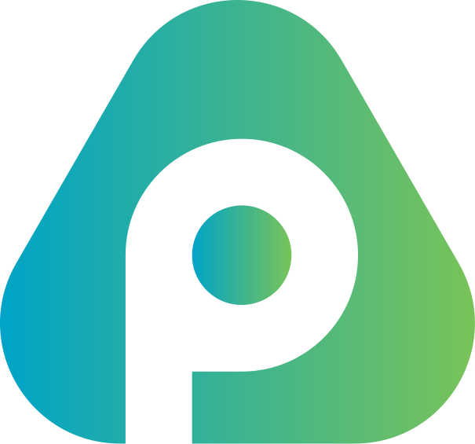

<a id="readme-top"></a>


[](https://creativecommons.org/licenses/by-nc-sa/4.0/)

<!-- PROJECT LOGO -->
<br />
<div align="center">
  <a href="https://github.com/brendan-sadlier/pokero">
    
  </a>
</div>

<h3 align="center">Pokero</h3>

Pokero makes planning poker effortless.
Start a session in seconds, invite your team, and estimate together without distractions.

✅ **No logins**

✅ **No clutter**

✅ **Just fast, fun, accurate planning**

👉 Try it live: https://pokero.dev

<!-- ABOUT THE PROJECT -->

## About The Project

[![Product Name Screen Shot][product-screenshot]](https://pokero.dev)

### 🚀 Features

- 🔮 Real-time planning poker estimation

- 🔗 Shareable session links — no signup required

- 🎨 Clean, distraction-free UI

- ⚡️ Built with lightning-fast web tech

- 📱 Responsive and team-friendly on all devices

### 🛠️ Built With

[![Vite][Vite]][Vite-url]
[![React][React.js]][React-url]
[![Typescript][Typescript]][Typescript-url]
[![Tailwind][Tailwindcss.com]][Tailwindcss-url]
[![Shadcn][Shadcn]][Shadcn-url]

## 💻 Running Locally

This is an example of how you may give instructions on setting up your project locally.
To get a local copy up and running follow these simple example steps.

### 1️⃣ Clone the Repository

```
git clone https://github.com/brendan-sadlier/pokero.git
cd pokero
```

### 2️⃣ Install Dependencies

```
npm install
```

### 3️⃣ Start the Frontend

```
npm run dev
```

### 4️⃣ Start the Backend (PartyKit)

```
npx partykit dev
```

🎉 That’s it! No environment variables needed.

## 🗂️ Project Structure

```
pokero/
├── src/ # Frontend source
│ ├── components/ # UI Components (Shadcn + custom)
│ ├── lib/ # Utility files
│ ├── pages/ # App pages + routing
│ ├── types/ # Data Types
│ └── ...
├── partykit/ # Real-time server logic
├── public/ # Static assets
└── package.json
```

## 🤝 Contributing

Contributions are what make the open source community such an amazing place to learn, inspire, and create. Any contributions you make are **greatly appreciated**.

If you have a suggestion that would make this better, please fork the repo and create a pull request. You can also simply open an issue with the tag "enhancement".
Don't forget to give the project a star! Thanks again!

1. Fork the Project
2. Create your Feature Branch (`git checkout -b feature/AmazingFeature`)
3. Commit your Changes (`git commit -m 'Add some AmazingFeature'`)
4. Push to the Branch (`git push origin feature/AmazingFeature`)
5. Open a Pull Request

<!-- LICENSE -->

## 📜 License

This project is licensed under the **Creative Commons Attribution-NonCommercial-ShareAlike 4.0 International License (CC BY-NC-SA 4.0)**.

You are free to use, modify, and share this project for **non-commercial purposes**, as long as you:

- Provide attribution to **Brendan Sadlier**
- Share any derivative works under the **same license**
- Do not use the project, name, or code for commercial gain

🔗 Full license: https://creativecommons.org/licenses/by-nc-sa/4.0/

[product-screenshot]: public/pokero-screenshot.png
[Vite]: https://img.shields.io/badge/Vite-646CFF?style=for-the-badge&logo=vite&logoColor=white
[Vite-url]: https://vite.dev/
[React.js]: https://img.shields.io/badge/React-20232A?style=for-the-badge&logo=react&logoColor=61DAFB
[React-url]: https://reactjs.org/
[Typescript]: https://img.shields.io/badge/TypeScript-3178C6?style=for-the-badge&logo=typescript&logoColor=white
[Typescript-url]: https://www.typescriptlang.org/
[Tailwindcss.com]: https://img.shields.io/badge/Tailwind-06B6D4?style=for-the-badge&logo=tailwind-css&logoColor=white
[Tailwindcss-url]: https://tailwindcss.com/
[Shadcn]: https://img.shields.io/badge/shadcn/ui-%23000000?style=for-the-badge&logo=shadcnui&logoColor=white
[shadcn-url]: https://jquery.com
